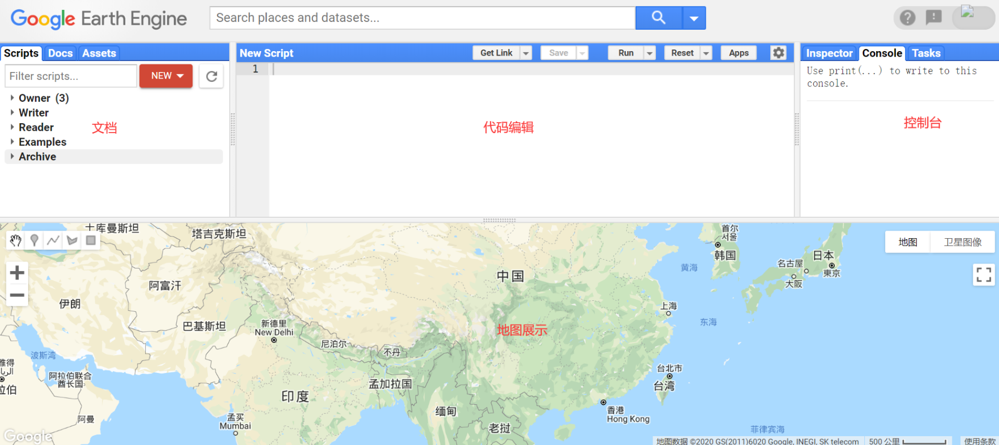

# 第1节 认识GEE

## 1.1 什么是GEE

* 简单来说：科研党可以**免费**使用Google海量服务器的云计算能力处理遥感数据，促使大尺度地理研究变得更加简单。
* 大数据平台：GEE包含的数据集超过200个公共的数据集，超过500万张影像，每天的数据量增加大约400张影像，容量超过5PB
* 云计算平台：Google公司百万台高性能服务器

## 1.2 应用程序编程接口（API）

* 在线的Javascript API（主要学习平台和语言）

  官方地址: [https://code.earthengine.google.com/](https://code.earthengine.google.com/)

