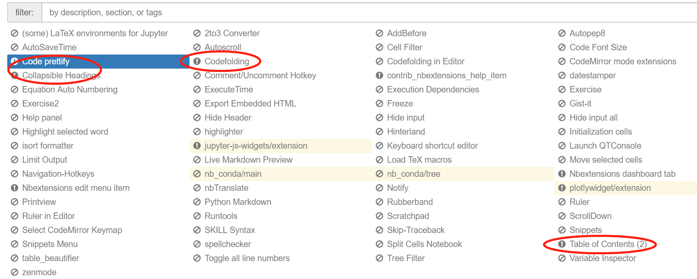

# 2.3节 补充-客户端连接远程服务器的Jupyter

**如果有服务器账号，可以利用客户端连接远程服务器的Jupyter进行开发（git 作为工具）**

## 1 远程访问

* 进入虚拟环境 `conda activate <虚拟环境>`
* 生成配置文件 `jupyter notebook --generate-config`
* 生成密码\(之后输入两次密码\) `python -c "import IPython;print(IPython.lib.passwd())"`
* 记住生成的密钥 `sha1:***:**`
* 生成jupyter book 的配置文件 `jupyter notebook --generate-config`
* 修改配置文件

```python
c.NotebookApp.ip = '*'  # 允许访问此服务器的 IP，星号表示任意 IP

c.NotebookApp.password = 
u'sha1:**:**' # 之前生成的密码 
hash 字串

c.NotebookApp.open_browser = False # 运行时不打开本机浏览器

c.NotebookApp.port = 8080 # 使用的端口

c.NotebookApp.enable_mathjax = True # 启用 MathJa

c.NotebookApp.notebook_dir = '/**' # 文件夹
```

* 运行jupyter book `nohup jupyter notebook --no-browser --port=8080 --ip=127.0.0.1 > jupypter.log 2>&1 &`
* 再打开一个git 客户端 `ssh -N -f -L 127.0.0.1:8080:127.0.0.1:8080 username@ip`
* 本地浏览器输入

  `127.0.0.1:8080`

## 3 Jupyter 配置多个 python 不同本版

Make sure you have ipykernel installed in your environment. If you are using `pip to install ipykernel in a conda env`, make sure pip is installed: source activate myenv

```text
conda install pip
conda install ipykernel # or pip install ipykernel
```

```text
source activate myenv
python -m ipykernel install --user --name myenv --display-name "Python (myenv)"
```

```text
source activate other-env
python -m ipykernel install --user --name other-env --display-name "Python (other-env)"
```

## 4 Jupyter 安装插件

`conda install -c conda-forge jupyter_contrib_nbextensions`

`conda install -c conda-forge jupyter_contrib_nbextensions`

* 勾选 代码折叠、目录.....



## 5 Jupyter 安装主题（比较鸡肋）

`conda install jupyterthemes` `jt -t oceans16 -f fira -fs 9 -cellw 90% -ofs 9 -dfs 9 -T`

