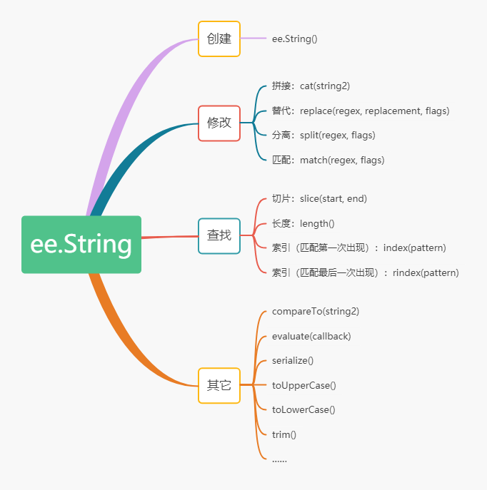

# 1 ee.String

* String是GEE中基本的数据类型，代表"字符串"的意思，在进行开发的时候，肯定是需要对一些字符串进行操作的。下面介绍字符串的常用基本操作。



```python
// 创建字符串
var str1 = ee.String("hello");
var str2 = ee.String("world");
print("创建字符串:",str1,str2);


// 拼接字符串
var str1 = ee.String("hello");
var str2 = ee.String("world");
var str = str1.cat(str2);
print("拼接字符串:",str);// 结果是：helloworld

// 替换
var str1 = ee.String("A,B,C,D");
var str = str1.replace("A","B");
print("替换字符串:",str);//结果是：B,B,C,D

// 分离
var str1 = ee.String("A,B,C,D");
var str = str1.split(",");
print(str);//结果是：["A","B","C","D"]

// 匹配
var str1 = ee.String("A,B,C,D");
var str = str1.match("A");
print("匹配字符串:",str);//：结果是：["A"]

// 切片
var str1 = ee.String("hello world");
var str = str1.slice(0,4);
print("选取字符串:",str);//：结果是：hell

// 长度
var str1 = ee.String("hello world");
var len = str1.length();
print("字符串的长度:",len);//：结果是：11

// 索引，index返回从左到右第一次匹配出现的位置，rindex返回匹配最后出现的位置
var str1 = ee.String("hello world");
var index1 = str1.index("l");
var index2 = str1.rindex("l");
print("找到字符串出现的索引:",index1,index2);//结果是：2，9

// 按字典顺序比较两个字符串。返回：如果两个字符串在字典上相等，则返回0。如果string1小于string2，则该值小于0；如果字符串1在字典上大于字符串2，则该值大于0。
var str1 = ee.String("A");
var str2 = ee.String("C");
var str3 = ee.String("C");
var index1 = str1.compareTo(str2);
var index2 = str2.compareTo(str1);
var index3 = str2.compareTo(str3);
print("创建字符串:",index1,index2,index3);//结果是：-2，2，0

// 字母变成大写
var str1 = ee.String("aaa");
var str = str1.toUpperCase();
print("字母变成大写:",str);//结果是：AAA

//字母变成小写
var str1 = ee.String("BBB");
var str = str1.toLowerCase();
print("字母变成小写:",str);//结果是：bbb

// 去除左右两端的空格
str1 = ee.String(" abc ");
var str = str1.trim();
print("去除左右两端的空格:",str);//结果是：abc
```

## 激励自己，尽可能每周更新1-2篇，2020加油！！！

## 需要交流或者有项目合作可以加微信好友 \(备注GEE\)

## 微信号：comingboy0701

