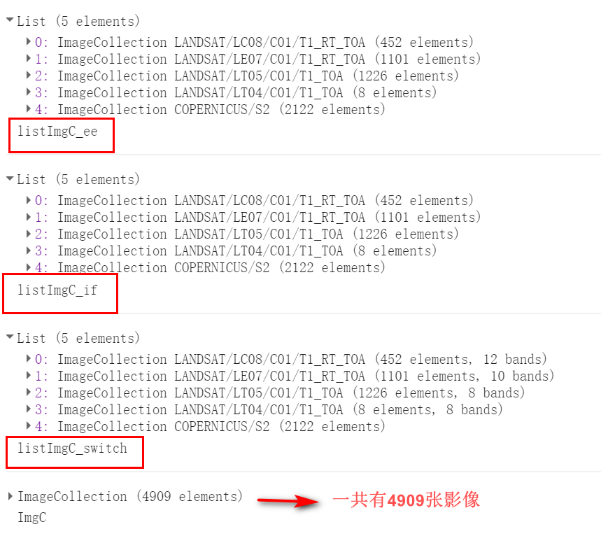

# 3.2节 if,switch,ee.Algorithms.If的异同

## 1. 数据说明
- 很多做时间序列的遥感研究，可能需要尽可能多的遥感影像数据
- 合并武汉市从1986-2020年期间所有的Landsats影像和哨兵2数据影像
```
'LANDSAT/LC08/C01/T1_RT_TOA',
'LANDSAT/LE07/C01/T1_RT_TOA',
'LANDSAT/LT05/C01/T1_TOA',
'LANDSAT/LT04/C01/T1_TOA',
'COPERNICUS/S2'
```
- 然后把这些不同影像的波段重新命名
- 实现这个目的，分布展示 if, switch ,ee.Algorithms.If,之间的用法
- 其实在实际开发的时候，最好写ee.Algorithms.If，这也是官方推荐的用法

## 2. 结果展示


## 3. 其它相关函数：去噪函数（云，阴影，雪），重命名函数
```
// 哨兵2去噪
var maskS2Cloud = function (image) {
    var qa = image.select('QA60');
    var mask = qa.bitwiseAnd(1 << 10)
        .or(qa.bitwiseAnd(1 << 11))
    return image.updateMask(mask.not())
};
// Landsat去噪
var maskLandsatCloud = function (image) {
    var qa = image.select('BQA');
    var mask = qa.bitwiseAnd(1 << 4)
        .or(qa.bitwiseAnd(1 << 8));
    return image.updateMask(mask.not());
};
// Landsat8重命名
var landsatRe8Band = function (img) {
    return img.select('B2', 'B3', 'B4', 'B5', 'B6', 'B7', 'B10')
        .rename('B1', 'B2', 'B3', 'B4', 'B5', 'B6', 'B7');
}
// Landsat7重命名
var landsatRe7Band = function (img) {
    return img.select('B1', 'B2', 'B3', 'B4', 'B5', 'B7', 'B6_VCID_1')
        .rename('B1', 'B2', 'B3', 'B4', 'B5', 'B6', 'B7');
};
// Landsat4,Landsat5重命名
var landsatRe45Band = function (img) {
    return img.select('B1', 'B2', 'B3', 'B4', 'B5', 'B7', 'B6')
        .rename('B1', 'B2', 'B3', 'B4', 'B5', 'B6', 'B7');
};
// 哨兵2重命名
var s2ReBand = function (img) {
    return img.select('B2', 'B3', 'B4', 'B8', 'B11', 'B12', 'B9')
        .rename('B1', 'B2', 'B3', 'B4', 'B5', 'B6', 'B7');
};
```
## 4. ee.Algorithms.If的用法
```
var getImg = function (landstr) {
    ImgC = ee.ImageCollection(landstr)
        .filterBounds(roi)
        .filterDate("1986-01-01", "2020-12-30");
    var img_indx = (landstr).slice(11, 12);
    var ImgC = ee.Algorithms.If({
        condition: img_indx == 8,
        trueCase: ImgC.map(maskLandsatCloud).map(landsatRe8Band),
        falseCase: ee.Algorithms.If({
            condition: img_indx == 7,
            trueCase: ImgC.map(maskLandsatCloud).map(landsatRe7Band),
            falseCase: ee.Algorithms.If({
                condition: img_indx == 5 || img_indx == 4,
                trueCase: ImgC.map(maskLandsatCloud).map(landsatRe45Band),
                falseCase: ImgC.map(maskS2Cloud).map(s2ReBand).map(function (img) {
                    return img.divide(10000).set('system:time_start', ee.Date(img.date()).millis());
                })
            })
        })
    });
    return ImgC;
};
```
## 5. if 的用法
```
var getImg_if = function (landstr) {
    ImgC = ee.ImageCollection(landstr)
        .filterBounds(roi)
        .filterDate("1986-01-01", "2020-12-30");
    var img_indx = (landstr).slice(11, 12);
    if (img_indx == 8) {
        ImgC = ImgC
            .map(maskLandsatCloud)
            .map(landsatRe8Band);
    }
    else if (img_indx == 7) {
        ImgC = ImgC
            .map(maskLandsatCloud)
            .map(landsatRe7Band);
    }
    else if (img_indx == 'S') {
        ImgC = ImgC
            .map(maskS2Cloud)
            .map(s2ReBand)
            .map(function (img) {
                return img.divide(10000).set("system:time_start", ee.Date(img.date()).millis())
            })
    }
    else {
        ImgC = ImgC
            .map(maskLandsatCloud)
            .map(landsatRe45Band);
    }
    return ImgC;
};
```

## 6. switch 的用法
```
var getImg_switch = function (landstr) {
    ImgC = ee.ImageCollection(landstr)
        .filterBounds(roi)
        .filterDate("1986-01-01", "2020-12-30");
    var img_indx = (landstr).slice(11, 12);
    var ImgC;
    switch (img_indx) {
        case 8:
            ImgC = ImgC
                .map(maskLandsatCloud)
                .map(landsatRe8Band);
            break;
        case 7:
            ImgC = ImgC
                .map(maskLandsatCloud)
                .map(landsatRe7Band);
            break;
        case 4 || 5:
            ImgC = ImgC
                .map(maskLandsatCloud)
                .map(landsatRe45Band);
            break;
        case "S":
            ImgC = ImgC
                .map(maskS2Cloud)
                .map(s2ReBand)
                .map(function (img) {
                    return img.divide(10000).set("system:time_start", ee.Date(img.date()).millis())
                })
            break;
    }

    return ImgC;
};
```

## 7. 分别调用这些函数，展示不同的结果
```
var landstr = ['LANDSAT/LC08/C01/T1_RT_TOA',
    'LANDSAT/LE07/C01/T1_RT_TOA',
    'LANDSAT/LT05/C01/T1_TOA',
    'LANDSAT/LT04/C01/T1_TOA',
    'COPERNICUS/S2'];

var listImgC_ee = landstr.map(getImg_ee);
print(listImgC_ee, "listImgC_ee")

var listImgC_if = landstr.map(getImg_if);
print(listImgC_if, "listImgC_if")

var listImgC_switch = landstr.map(getImg_switch);
print(listImgC_switch, "listImgC_switch")
```

## 8. 补充 iterate 的用法
迭代的意思就是在前一个的基础上再次计算结果
这是表现了在前一个影像集合的基础上一一添加数据，合并所有数据集的效果
```
var mergeImgC = function (current, list) {
    return ee.ImageCollection(list).merge(current);
};

// 合并所有的影像到一个ImageCollection
var ImgC = ee.ImageCollection(ee.List(listImgC_ee).iterate(mergeImgC, ee.ImageCollection([])))
    .sort('system:time_start', false);
print(ImgC, "ImgC")
```

### <font color=blue> 激励自己，尽可能每周更新1-2篇，2020加油！！！ </font>

### <font color=blue> 需要交流或者有项目合作可以加微信好友 (备注GEE) </font>

### <font color=blue> 微信号：comingboy0701 </font>