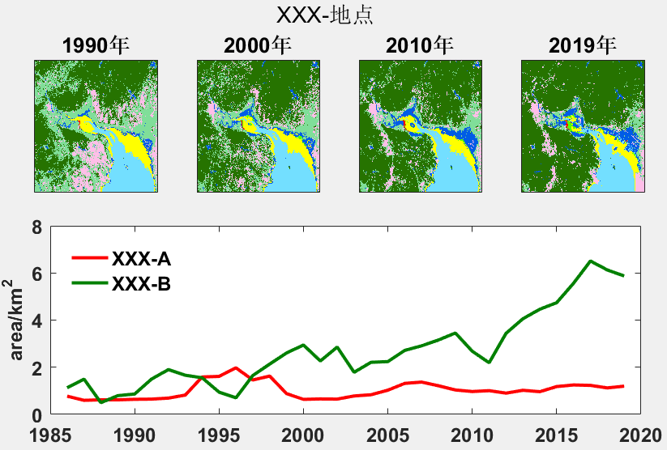

# 第1节 matlab读取GEE下载的tif影像并自定义颜色画图显示

## 1 数据说明：

land\_site06.tif 是通过 GEE 处理好的土地利用分类tif格式数据,其中有34个波段，每个波段代表某个年份地物分类情况，一共有8种地物类别

## 2 结果显示



## 3 详情代码

```python
clear;clc;
file = '../data/land_site06.tif';
[A,R]= geotiffread(file); %读取tif的栅格数据
year = [1990 2000 2010 2019]; 
H = nan(length(year),1);
mymap = [255,0,0
    85,255,0
    255,255,0
    115,223,255
    38,115,0
    255,190,232
    128,222,153
    0,92,230]/255; % 颜色
figure(1);
set(gcf,'Position',[200,200,800,400]);%设置在屏幕图的位置和大小
for i = 1:length(year)
    subplot(2,4,i)
    img = A(:,:,year(i)-1985);%挑选需要的年份年份
    img(img==0) =8; % 0 也是其它，其实0是没有分类的情况，注意一下
    H(i) = imagesc(img);%显示图片
    colormap(mymap) %加入不同地物类型不同的颜色，自己选自己想要的颜色
%     colorbar('Ticks',[1  2  3  4 ,5 ,6 ,7, 8],...
%     'TickLabels',{'红树','米草','滩涂','水系','树','建筑','其它','养殖塘'}) %
%     这是加图例，不需要,之后自己画上，为了好看而已，你自己随缘吧
    title([num2str(year(i)),'年'],'FontSize',12,'FontWeight','bold') % 加小标题年份
    set(gca,'xtick',[],'ytick',[],'FontSize',12,'FontWeight','bold')

end
suptitle('XXX-地点') %加总标题
set(gca,'FontSize',12,'FontWeight','bold');%控制总标题的大小，粗细
%% 自己会画面积吗？
subplot(2,4,[5,6,7,8]) %面积的子图，其实是一共是2行4列，第一行的4列画tif,第二行的4个子图变成一个画面积趋势
area = nan(34,9); % 计算面积，先生成的34行*9列的数组，用来放时间和每种类型的面积
for i = 1:34
    img = A(:,:,i);
    area(i,1) = i+1985; %第一列是年份
    for j = 1:8
        area_i = sum(sum(img==j))*900/1e6;% 转成 km2
        area(i,j+1) = area_i;
    end
end
h= plot(area(:,1),area(:,[2,3])); % 只画红树林和米草的面积，1代表红树,2代表米草
set(h(1) , 'linestyle','-','LineWidth',2,'Color',[1 0 0]) % 设置XXX-A线的样式
set(h(2), 'linestyle','-','LineWidth',2,'Color',[0 0.5 0])% 设置XXX-B线的颜色
set(gca,'xlim',[1985 2020]) % 控制 X 轴的范围
set(gca,'xtick',1985:5:2020,'FontSize',12,'FontWeight','bold') %控制 X 轴的刻度和样式
ylabel('area/km^2','FontSize',12,'FontWeight','bold') %控制 Y 轴 标签样式
legend(h,'Location','northwest',{'XXX-A','XXX-B'},'FontSize',12,'FontWeight','Bold','box','off') %图例的样式
set(gca,'position',[0.15 0.1 0.75 0.4 ]) % 总体控制所有图的字体大小，习惯这样写，不写也行
```

### 激励自己，尽可能每周更新1-2篇，2020加油！！！

### 需要交流或者有项目合作可以加微信好友 \(备注GEE\)

### 微信号：comingboy0701

