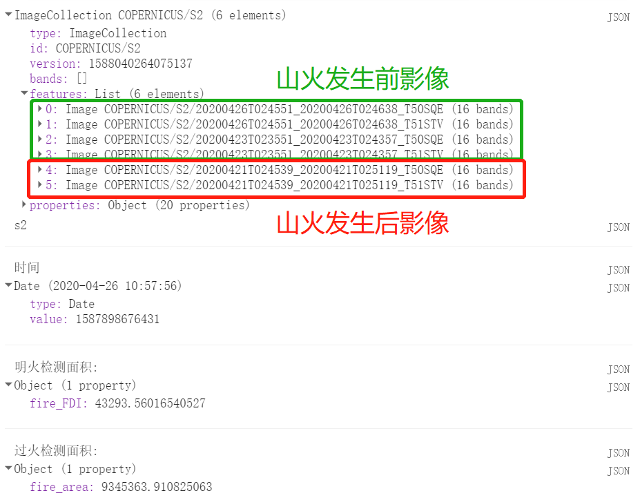
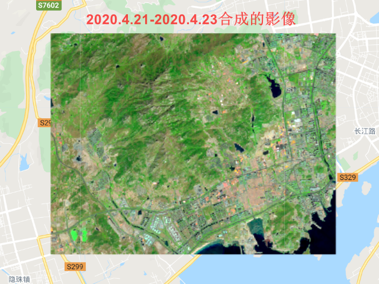
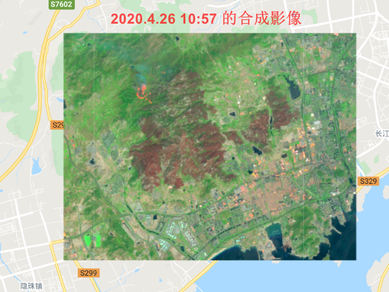
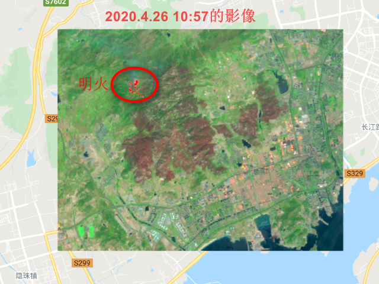
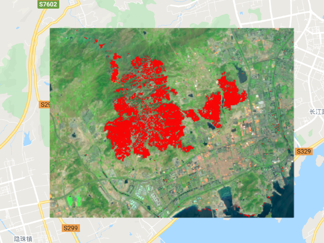

# 第9节 快速检测山东山火面积和明火位置

- 备注：以下纯属学习，数据真实性还有待检测
- 看到这样的事情真的很痛惜，这么好的景色，几天之内就化为灰烬

### 1 数据说明
- 数据来源：选用Sentinel-2的影像
- 具体数据和结果如下所示


### 2 结果
1. 山火发生前后真彩色对比

| 发生前 | 发生后 |
| :---: | :---: |
|  |  |

2. 明火检测和过火面积估测

| 发生前 | 发生后 |
| :---: | :---: |
|  |  |

### 3 详细代码

```python
var roi = 
    /* color: #d63000 */
    /* shown: false */
    /* displayProperties: [
      {
        "type": "rectangle"
      }
    ] */
    ee.Geometry.Polygon(
        [[[120.0459831156161, 35.9860397515576],
          [120.0459831156161, 35.90905077800842],
          [120.16854933876063, 35.90905077800842],
          [120.16854933876063, 35.9860397515576]]], null, false);
Map.centerObject(roi, 12);

var addVariables = function(image){
  var FDI = image.expression("SWIR2/Redge",{
    Redge: image.select("B5"),
    SWIR2: image.select("B12")
  }).rename('FDI');
  var ndvi = image.normalizedDifference(['B8','B4']).rename('NDVI')
  return image.addBands([FDI,ndvi]);
}

var S2 = ee.ImageCollection('COPERNICUS/S2')
            .filterBounds(roi)
            .filterDate("2020-04-21", "2020-04-28")
            .sort("system:time_start",false)
            
print(S2,"s2")
print("时间",S2.first().date().advance(8,"hour")) 

var S2_01 = ee.ImageCollection('COPERNICUS/S2')
        .filterBounds(roi)
        .filterDate("2020-04-21", "2020-04-24")
        .map(addVariables)
        .mosaic()
        .clip(roi)

var S2_02 = ee.ImageCollection('COPERNICUS/S2')
        .filterBounds(roi)
        .filterDate("2020-04-26", "2020-04-27")
        .map(addVariables)
        .mosaic()
        .clip(roi)
        
// true image      
var visParams01 = {"bands": ["B12", "B8", "B4"],"min": 500,"max": 4000, gamma: 1.5, scale: 10};
Map.addLayer(S2_01,visParams01, "S2_01_true");
Map.addLayer(S2_02,visParams01, "S2_02_ture");

// 检测火点
var FDI01 = S2_01.select("FDI");
var FDI02 = S2_02.select("FDI");
var fire_FDI = FDI02.subtract(FDI01);
var fire_FDI = FDI02.gte(3).and(fire_FDI.gte(2));
var fire_FDI = fire_FDI.updateMask(fire_FDI.eq(1)).rename('fire_FDI');
Map.addLayer(fire_FDI, {palette: 'red'}, 'FDI');

// 检测火点面接
var FDI_area = fire_FDI.multiply(ee.Image.pixelArea());
var FDI_area = FDI_area.reduceRegion({
                  reducer: ee.Reducer.sum(),
                  geometry: roi, 
                  scale: 10, 
                  maxPixels: 1e13
                });
print("明火检测面积:",FDI_area);

// 统计燃烧的面积
var ndvi01 = S2_01.select("NDVI");
var ndvi02 = S2_02.select("NDVI");
var fire_area = ndvi01.subtract(ndvi02);
var fire_area = fire_area.gte(0.1)
                .and(ndvi01.gte(0.15))
                .and(ndvi02.lte(0.15));
                
var fire_area = fire_area.updateMask(fire_area.eq(1)).rename('fire_area');
Map.addLayer(fire_area,{min: 0, max:1, palette: ['green','red']}, "fire_area");


var fire_area = fire_area.multiply(ee.Image.pixelArea());
var fire_area = fire_area.reduceRegion({
                  reducer: ee.Reducer.sum(),
                  geometry: roi, 
                  scale: 10, 
                  maxPixels: 1e13
                });
     
print("过火检测面积:",fire_area);

```


### 激励自己，尽可能每周更新1-2篇，2020加油！！！

### 需要交流或者有项目合作可以加微信好友 \(备注GEE\)

### 微信号：comingboy0701
