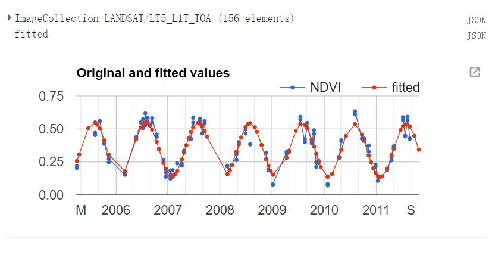

# 第12节 对时间序列的影像进行非线性拟合：简单求解


## 1 数据说明

- LANDSAT/LT5_L1T_TOA
- 详细的说明可以看注释


## 2 结果展示




## 3 详细代码

```python
// Array Example:
// Linear Modeling of an ImageCollection

// longitude and latitude
var lon = 114.05;
var lat = 30.49;
var roi= ee.FeatureCollection("users/comingboy1118/China/CH_shi");
var roi= roi.filter(ee.Filter.eq("市","武汉市"));
Map.addLayer(roi,{},"roi")
// This function masks the input with a threshold on the simple cloud score.
var cloudMask = function(img) {
  var cloudscore = ee.Algorithms.Landsat.simpleCloudScore(img).select('cloud');
  return img.updateMask(cloudscore.lt(50));
};

// Load a Landsat 5 image collection.
var collection = ee.ImageCollection('LANDSAT/LT5_L1T_TOA')
  // Filter to get only two years of data.
  .filterDate('2005-04-01', '2018-04-01')
  // Filter to get only imagery at a point of interest.
  .filterBounds(ee.Geometry.Point(lon, lat))
  // Mask clouds by mapping the cloudMask function over the collection.
  .map(cloudMask)
  // Select NIR and red bands only.
  .select(['B4', 'B3'])
  // Sort the collection in chronological order.
  .sort('system:time_start', true);

// This function computes the predictors and the response from the input.
var makeVariables = function(image) {
  // Compute time in fractional years relative to the start of the Epoch.
  var year = image.date().difference(ee.Date('1970-01-01'), 'year');
  // Compute the season in radians, one cycle per year.
  var season = ee.Image(year.multiply(2 * Math.PI));
  // Return an image of the predictors followed by the response.
  return image.select()
    .addBands(ee.Image(1))                                  // 0. constant term
    .addBands(ee.Image(year).rename('t'))                   // 1. linear change
    .addBands(season.sin().rename('sin'))                   // 2. seasonal change
    .addBands(season.cos().rename('cos'))                   // 3. seasonal change
    .addBands(image.normalizedDifference().rename('NDVI'))  // 4. response variable
    .toFloat();
};

// Define the axes of variation in the collection array.
var imageAxis = 0;
var bandAxis = 1;

// Convert the collection to an array.
var array = collection.map(makeVariables).toArray();

// Check the length of the image axis (number of images).
var arrayLength = array.arrayLength(imageAxis);
// Update the mask to ensure that the number of images is greater than or
// equal to the number of predictors (the linear model is solveable).
array = array.updateMask(arrayLength.gt(4));

// Get slices of the array according to positions along the band axis.
var predictors = array.arraySlice(bandAxis, 0, 4);
var response = array.arraySlice(bandAxis, 4);

// Solve for linear regression coefficients in three different ways.
// All three methods produce equivalent results, but some are easier.
// coefficients the hard way
var coefficients1 = predictors.arrayTranspose().matrixMultiply(predictors)
  .matrixInverse().matrixMultiply(predictors.arrayTranspose())
    .matrixMultiply(response);
// coefficients the easy way
var coefficients2 = predictors.matrixPseudoInverse()
  .matrixMultiply(response);
// coefficients the easiest way
var coefficients3 = predictors.matrixSolve(response);

// turn the results into a multi-band image
var coefficientsImage = coefficients3
  .arrayProject([0]) // get rid of the extra dimensions
  .arrayFlatten([
    ['constant', 'trend', 'sin', 'cos']
]);

// use this mask for cartographic purposes, to get rid of water areas
var hansenImage = ee.Image('UMD/hansen/global_forest_change_2013');
var mask = hansenImage.select('datamask').eq(1);

// display the result
Map.setCenter(lon, lat, 8);
Map.addLayer(coefficientsImage.mask(mask).clip(roi), {
  bands: ['sin', 'trend', 'cos'],
  min: [-0.05, -0.1, -0.05],
  max: [0.05, 0.1, 0.05],
});

// plot the results
var fitted = collection.map(makeVariables).map(function(image) {
  var coeffs = coefficientsImage.select(['constant', 'trend', 'sin', 'cos']);
  var predicted = image
    .select(['constant', 't', 'sin', 'cos'])
    .multiply(coeffs)
    .reduce('sum')
    .rename('fitted');
  return image.select('NDVI').addBands(predicted);
});
print(fitted,'fitted')

var roi = ee.Geometry.Point(lon, lat);

print(Chart.image.series(fitted.select(['NDVI','fitted']), roi, ee.Reducer.mean(), 30)
    .setChartType('LineChart')
    .setSeriesNames([ 'NDVI',"fitted"])
    .setOptions({
      title: 'Original and fitted values',
      lineWidth: 1,
      pointSize: 3,
      fontSize: 16
}));
```

### 激励自己，尽可能每周更新1-2篇，2020加油！！！

### 需要交流或者有项目合作可以加微信好友 (姓名+专业+学校)

### 微信号：comingboy0701

### 公众号：猿人充电站
