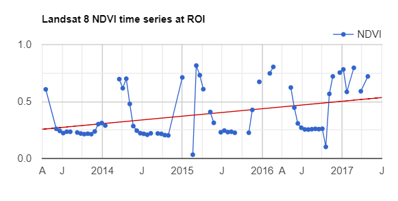
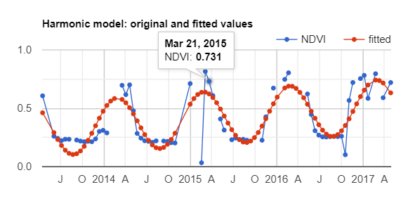
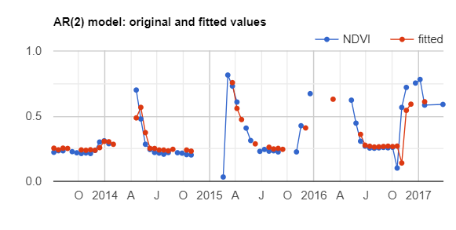
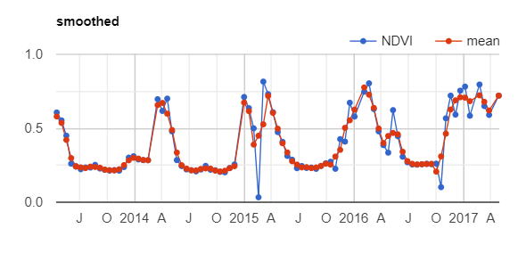

# 第13节 对时间序列的影像进行非线性拟合：平滑处理


## 1 数据说明

- LANDSAT/LC8_L1T_TOA
- 详细的说明可以看注释


## 2 结果展示

**线性和非线性拟合**


| 线性 | 非线性 |
| :---: | :---: |
|  |  |


**滑动平均值**


| 原始值 | 滑动平均值 |
| :---: | :---: |
|  |  |


## 3 详细代码

```python
var l8toa = ee.ImageCollection("LANDSAT/LC8_L1T_TOA");
var roi = ee.Geometry.Point([-121.9353461265564, 37.56180984982223]);

    
Map.centerObject(roi, 10);

// This field contains UNIX time in milliseconds.
var timeField = 'system:time_start';

// Use this function to mask clouds in Landsat 8 imagery.
var maskClouds = function(image) {
  var quality = image.select('BQA');
  var cloud01 = quality.eq(61440);
  var cloud02 = quality.eq(53248);
  var cloud03 = quality.eq(28672);
  var mask = cloud01.or(cloud02).or(cloud03).not();
  return image.updateMask(mask);
};

// Use this function to add variables for NDVI, time and a constant
// to Landsat 8 imagery.
var addVariables = function(image) {
  // Compute time in fractional years since the epoch.
  var date = ee.Date(image.get(timeField));
  var years = date.difference(ee.Date('1970-01-01'), 'year');
  // Return the image with the added bands.
  return image
    // Add an NDVI band.
    .addBands(image.normalizedDifference(['B5', 'B4']).rename('NDVI')).float()
    // Add a time band.
    .addBands(ee.Image(years).rename('t').float())
    // Add a constant band.
    .addBands(ee.Image.constant(1));
};

// Remove clouds, add variables and filter to the area of interest.
var filteredLandsat = l8toa
  .filterBounds(roi)
  .map(maskClouds)
  .map(addVariables);

// Plot a time series of NDVI at a single location.
var l8Chart = ui.Chart.image.series(filteredLandsat.select('NDVI'), roi)
    .setChartType('ScatterChart')
    .setOptions({
      title: 'Landsat 8 NDVI time series at ROI',
      trendlines: {0: {
        color: 'CC0000'
      }},
      lineWidth: 1,
      pointSize: 3,
    });
print(l8Chart);

// Linear trend ----------------------------------------------------------------
// List of the independent variable names
var independents = ee.List(['constant', 't']);

// Name of the dependent variable.
var dependent = ee.String('NDVI');

// Compute a linear trend.  This will have two bands: 'residuals' and 
// a 2x1 band called coefficients (columns are for dependent variables).
var trend = filteredLandsat.select(independents.add(dependent))
    .reduce(ee.Reducer.linearRegression(independents.length(), 1));
// Map.addLayer(trend, {}, 'trend array image');

// Flatten the coefficients into a 2-band image
var coefficients = trend.select('coefficients')
  .arrayProject([0])
  .arrayFlatten([independents]);

// Compute a de-trended series.
var detrended = filteredLandsat.map(function(image) {
  return image.select(dependent).subtract(
          image.select(independents).multiply(coefficients).reduce('sum'))
          .rename(dependent)
          .copyProperties(image, [timeField]);
});

// Plot the detrended results.
var detrendedChart = ui.Chart.image.series(detrended, roi, null, 30)
    .setOptions({
      title: 'Detrended Landsat time series at ROI',
      lineWidth: 1,
      pointSize: 3,
    });
print(detrendedChart);

// Harmonic trend ----------------------------------------------------------------
// Use these independent variables in the harmonic regression.
var harmonicIndependents = ee.List(['constant', 't', 'cos', 'sin']);

// Add harmonic terms as new image bands.
var harmonicLandsat = filteredLandsat.map(function(image) {
  var timeRadians = image.select('t').multiply(2 * Math.PI);
  return image
    .addBands(timeRadians.cos().rename('cos'))
    .addBands(timeRadians.sin().rename('sin'));
});
  
// The output of the regression reduction is a 4x1 array image.
var harmonicTrend = harmonicLandsat
  .select(harmonicIndependents.add(dependent))
  .reduce(ee.Reducer.linearRegression(harmonicIndependents.length(), 1));

// Turn the array image into a multi-band image of coefficients.
var harmonicTrendCoefficients = harmonicTrend.select('coefficients')
  .arrayProject([0])
  .arrayFlatten([harmonicIndependents]);

// Compute fitted values.
var fittedHarmonic = harmonicLandsat.map(function(image) {
  return image.addBands(
    image.select(harmonicIndependents)
      .multiply(harmonicTrendCoefficients)
      .reduce('sum')
      .rename('fitted'));
});


// Plot the fitted model and the original data at the ROI.
print(ui.Chart.image.series(
  fittedHarmonic.select(['fitted','NDVI']), roi, ee.Reducer.mean(), 30)
    .setSeriesNames(['NDVI', 'fitted'])
    .setOptions({
      title: 'Harmonic model: original and fitted values',
      lineWidth: 1,
      pointSize: 3,
}));

// Compute phase and amplitude.
var phase = harmonicTrendCoefficients.select('cos').atan2(
            harmonicTrendCoefficients.select('sin'));
            
var amplitude = harmonicTrendCoefficients.select('cos').hypot(
                harmonicTrendCoefficients.select('sin'));

// Use the HSV to RGB transform to display phase and amplitude
var rgb = phase.unitScale(-Math.PI, Math.PI).addBands(
          amplitude.multiply(2.5)).addBands(
          ee.Image(1)).hsvToRgb();
Map.addLayer(rgb, {}, 'phase (hue), amplitude (saturation)');

// Autocovariance and autocorrelation ---------------------------------------------
// Function to get a lagged collection.  Images that are within
// lagDays of image are stored in a List in the 'images' property.
var lag = function(leftCollection, rightCollection, lagDays) {
  var filter = ee.Filter.and(
    ee.Filter.maxDifference({
      difference: 1000 * 60 * 60 * 24 * lagDays,
      leftField: timeField, 
      rightField: timeField
    }), 
    ee.Filter.greaterThan({
      leftField: timeField, 
      rightField: timeField
  }));
  
  return ee.Join.saveAll({
    matchesKey: 'images',
    measureKey: 'delta_t',
    ordering: timeField, 
    ascending: false, // Sort reverse chronologically
  }).apply({
    primary: leftCollection, 
    secondary: rightCollection, 
    condition: filter
  });
};

// Lag the Landsat series to get the previous image.
// Note that the results vary when using detrended data
var lagged17 = lag(detrended, detrended, 17);

print(lagged17,'lagged17 ')

// Function to merge bands of a lagged collection.  If a collection is
// lagged with itself, the band names will be appended with an '_' and
// suffixed by an index of the order in which they were added.  Because
// the 'images' list is sorted reverse chronologically, band_1 is the t-1
// image when the band names collide.
var merge = function(image) {
  // Function to be passed to iterate.
  var merger = function(current, previous) {
    return ee.Image(previous).addBands(current);
  };
  return ee.ImageCollection.fromImages(image.get('images')).iterate(merger, image);
};

// Merge the bands together.
var merged17 = ee.ImageCollection(lagged17.map(merge));

// Function to compute covariance over time.  This will return 
// a 2x2 array image.  Pixels contains variance-covariance matrices.
var covariance = function(mergedCollection, band, lagBand) {
  return mergedCollection.select([band, lagBand]).map(function(image) {
    return image.toArray();
  }).reduce(ee.Reducer.covariance(), 8);
};

// Compute covariance from the merged series.
var lagBand = dependent.cat('_1');
var covariance17 = ee.Image(covariance(merged17, dependent, lagBand));
// (Note that covariance accentuates agriculture)
Map.addLayer(covariance17.arrayGet([0, 1]), {}, 'covariance (lag = 17 days)');

// Compute correlation from a 2x2 covariance image.
var correlation = function(vcArrayImage) {
  var covariance = ee.Image(vcArrayImage).arrayGet([0, 1]);
  var sd0 = ee.Image(vcArrayImage).arrayGet([0, 0]).sqrt();
  var sd1 = ee.Image(vcArrayImage).arrayGet([1, 1]).sqrt();
  return covariance.divide(sd0).divide(sd1).rename('correlation');
};

// Correlation
var correlation17 = correlation(covariance17);
// (Not sure what this means)
Map.addLayer(correlation17, {min: -1, max: 1}, 'correlation (lag = 17 days)');

// Lag the Landsat series to get the previous image.
var lagged34 = lag(detrended, detrended, 34);

// Merge the bands together.
var merged34 = ee.ImageCollection(lagged34.map(merge))
    .map(function(image) {
      return image.set('laggedImages', ee.List(image.get('images')).length());
    })
    .filter(ee.Filter.gt('laggedImages', 1));

// Compute covariance from the merged series.
var covariance34 = ee.Image(covariance(merged34, dependent, dependent.cat('_2')));
Map.addLayer(covariance34.arrayGet([0, 1]), {}, 'covariance34');

// Cross-correlation ----------------------------------------------------------------
// Precipitation (covariate)
var chirps = ee.ImageCollection('UCSB-CHG/CHIRPS/PENTAD');

// Join the precipitation images from a pentad ago
var lag1PrecipNDVI = lag(filteredLandsat, chirps, 5);
print('lag1PrecipNDVI', lag1PrecipNDVI);

// Add the precipitation images as bands.
var merged1PrecipNDVI = ee.ImageCollection(lag1PrecipNDVI.map(merge));
print('merged1PrecipNDVI', merged1PrecipNDVI);

// Compute covariance.
var cov1PrecipNDVI = covariance(merged1PrecipNDVI, 'NDVI', 'precipitation');
Map.addLayer(cov1PrecipNDVI.arrayGet([0, 1]), {}, 'NDVI - PRECIP cov (lag = 5)');

// Correlation.
var corr1PrecipNDVI = correlation(cov1PrecipNDVI);
Map.addLayer(corr1PrecipNDVI, {min: -0.5, max: 0.5}, 'NDVI - PRECIP corr (lag = 5)');

// Advanced cross-correlation----------------------------------------------------
// Join the precipitation images from the previous month
var lag30PrecipNDVI = lag(filteredLandsat, chirps, 30);
print(lag30PrecipNDVI);

var sum30PrecipNDVI = ee.ImageCollection(lag30PrecipNDVI.map(function(image) {
  var laggedImages = ee.ImageCollection.fromImages(image.get('images'));
  return ee.Image(image).addBands(laggedImages.sum().rename('sum'));
}));

// Compute covariance.
var cov30PrecipNDVI = covariance(sum30PrecipNDVI, 'NDVI', 'sum');
Map.addLayer(cov1PrecipNDVI.arrayGet([0, 1]), {}, 'NDVI - sum cov (lag = 30)');

// Correlation.
var corr30PrecipNDVI = correlation(cov30PrecipNDVI);
Map.addLayer(corr30PrecipNDVI, {min: -0.5, max: 0.5}, 'NDVI - sum corr (lag = 30)');


// AR models --------------------------------------------------------------------------
// Lag the Landsat series to get the previous image.
var lagged34 = ee.ImageCollection(lag(filteredLandsat, filteredLandsat, 34));

// Merge the bands together.
var merged34 = lagged34.map(merge).map(function(image) {
  return image.set('n', ee.List(image.get('images')).length());
}).filter(ee.Filter.gt('n', 1));

// These names are based on the default behavior of addBands(), which 
// appends '_n' for the nth time the band name is replicated.
var arIndependents = ee.List(['constant', 'NDVI_1', 'NDVI_2']);

var ar2 = merged34
  .select(arIndependents.add(dependent))
  .reduce(ee.Reducer.linearRegression(arIndependents.length(), 1));

// Turn the array image into a multi-band image of coefficients.
var arCoefficients = ar2.select('coefficients')
  .arrayProject([0])
  .arrayFlatten([arIndependents]);

// Compute fitted values.
var fittedAR = merged34.map(function(image) {
  return image.addBands(
    image.expression('beta0 + beta1 * p1 + beta2 * p2', {
      p1: image.select('NDVI_1'),
      p2: image.select('NDVI_2'),
      beta0: arCoefficients.select('constant'),
      beta1: arCoefficients.select('NDVI_1'),
      beta2: arCoefficients.select('NDVI_2')
    }).rename('fitted'));
});

// Plot the fitted model and the original data at the ROI.
print(ui.Chart.image.series(
  fittedAR.select(['fitted', 'NDVI']), roi, ee.Reducer.mean(), 30)
    .setSeriesNames(['NDVI', 'fitted'])
    .setOptions({
      title: 'AR(2) model: original and fitted values',
      lineWidth: 1,
      pointSize: 3,
}));

// Forecasting

var fill = function(current, list) {
  // Get the date of the last image in the list.
  var latestDate = ee.Image(ee.List(list).get(-1)).date();
  // Get the date of the current image being processed.
  var currentDate = ee.Image(current).date();
  // If those two dates are more than 16 days apart, there's
  // a temporal gap in the sequence.  To fill in the gap, compute
  // the potential starting and ending dates of the gap.
  var start = latestDate.advance(16, 'day').millis();
  var end = currentDate.advance(-16, 'day').millis();
  // Determine if the start and end dates are chronological.
  var blankImages = ee.Algorithms.If({
    // Watch out for this.  Might need a tolerance here.
    condition: start.lt(end), 
    // Make a sequence of dates to fill in with empty images.
    trueCase: ee.List.sequence({
      start: start,
      end: end,
      step: 1000 * 60 * 60 * 24 * 16
      }).map(function(date) {
        // Return a dummy image with a masked NDVI band and a date.
        return ee.Image(0).mask(0).rename('NDVI').set({
          'dummy': true,
          'system:time_start': ee.Date(date).millis()
        });
      }), 
    // If there's no gap, return an empty list.
    falseCase: []
  });
  // Add any dummy images and the current image to the list.
  return ee.List(list).cat(blankImages).add(current);
};

// The first image is the starting image.
var first = filteredLandsat.first();

// The first image is duplicated in this list, so slice it off.
var filled = ee.List(filteredLandsat.iterate(fill, [first])).slice(1);

// Now, map a function over this list to do the prediction.
var indices = ee.List.sequence(5, filled.length().subtract(1));

// A function to forecast from the previous two images.
var forecast = function(current, list) {
  var ndvi = ee.Image(current).select('NDVI');
  // Get the t-1 and t-2 images.
  var size = ee.List(list).size();
  var image1 = ee.Image(ee.List(list).get(size.subtract(1)));
  var image2 = ee.Image(ee.List(list).get(size.subtract(2)));
  
  var predicted = ee.Image().expression('beta0 + beta1 * p1 + beta2 * p2', {
      p1: image1.select('NDVI'),
      p2: image2.select('NDVI'),
      beta0: arCoefficients.select('constant'),
      beta1: arCoefficients.select('NDVI_1'),
      beta2: arCoefficients.select('NDVI_2')
  }).rename('NDVI')
      .set('system:time_start', current.get('system:time_start'));
  
  // Replace the entire image if it's a dummy.
  var replaced = ee.Algorithms.If({
    condition: current.get('dummy'), 
    trueCase: predicted, 
    // Otherwise replace only masked pixels.
    falseCase: current.addBands({
      srcImg: ndvi.unmask().where(ndvi.mask().not(), predicted).rename('NDVI'),
      overwrite: true
    })
  });
  // Add the predicted image to the list.
  return ee.List(list).add(replaced);
};

// Start at a point in the sequence with three consecutive real images.
var startList = filled.slice(4, 5);

// Iterate over the filled series to replace dummy images with predictions.
var modeled = ee.ImageCollection.fromImages(
  ee.ImageCollection(filled).iterate(forecast, startList)).select('NDVI');

print(ui.Chart.image.series(
  modeled, roi, ee.Reducer.mean(), 30)
    .setSeriesNames(['NDVI'])
    .setOptions({
      title: 'forecast',
      lineWidth: 1,
      pointSize: 3,
}));

// Smoothing ---------------------------------------------------------------
var join = ee.Join.saveAll({
  matchesKey: 'images'
});

var diffFilter = ee.Filter.maxDifference({
  difference: 1000 * 60 * 60 * 24 * 17,
  leftField: timeField, 
  rightField: timeField
});

var threeNeighborJoin = join.apply({
  primary: modeled, 
  secondary: modeled, 
  condition: diffFilter
});

var smoothed = ee.ImageCollection(threeNeighborJoin.map(function(image) {
  var collection = ee.ImageCollection.fromImages(image.get('images'));
  return ee.Image(image).addBands(collection.mean().rename('mean'));
}));

// Note that there is still a discontinuity in the chart.  While there may be
// two neighbors, the pixel may be masked at one or all of those times.
print(ui.Chart.image.series(
  smoothed.select(['NDVI', 'mean']), roi, ee.Reducer.mean(), 30)
    .setSeriesNames(['NDVI', 'mean'])
    .setOptions({
      title: 'smoothed',
      lineWidth: 1,
      pointSize: 3,
}));
```

### 激励自己，尽可能每周更新1-2篇，2020加油！！！

### 需要交流或者有项目合作可以加微信好友 (姓名+专业+学校)

### 微信号：comingboy0701

### 公众号：猿人充电站
