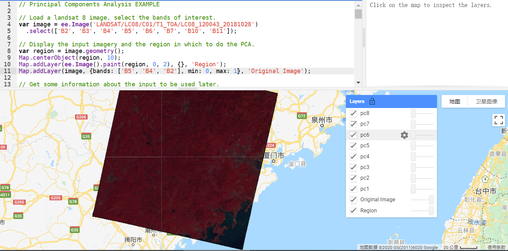

# 第15节 主成分分析例子(Principal Components Analysis)


## 1 数据说明
- 详细的说明可以看注释


## 2 结果展示





## 3 详细代码

```python
// Principal Components Analysis EXAMPLE

// Load a landsat 8 image, select the bands of interest.
var image = ee.Image('LANDSAT/LC8_L1T/LC80440342014077LGN00')
  .select(['B2', 'B3', 'B4', 'B5', 'B6', 'B7', 'B10', 'B11']);

// Display the input imagery and the region in which to do the PCA.
var region = image.geometry();
Map.centerObject(region, 10);
Map.addLayer(ee.Image().paint(region, 0, 2), {}, 'Region');
Map.addLayer(image, {bands: ['B5', 'B4', 'B2'], min: 0, max: 20000}, 'Original Image');

// Get some information about the input to be used later.
var scale = image.projection().nominalScale();
var bandNames = image.bandNames();

// Mean center the data to enable a faster covariance reducer 
// and an SD stretch of the principal components.
var meanDict = image.reduceRegion({
    reducer: ee.Reducer.mean(),
    geometry: region, 
    scale: scale,
    maxPixels: 1e9
});
var means = ee.Image.constant(meanDict.values(bandNames));
var centered = image.subtract(means);

// This helper function returns a list of new band names.
var getNewBandNames = function(prefix) {
  var seq = ee.List.sequence(1, bandNames.length());
  return seq.map(function(b) {
    return ee.String(prefix).cat(ee.Number(b).int());
  });
};

// This function accepts mean centered imagery, a scale and 
// a region in which to perform the analysis.  It returns the 
// Principal Components (PC) in the region as a new image.
// [START principal_components]
var getPrincipalComponents = function(centered, scale, region) {
  // Collapse the bands of the image into a 1D array per pixel.
  var arrays = centered.toArray();
  
  // Compute the covariance of the bands within the region.
  var covar = arrays.reduceRegion({
    reducer: ee.Reducer.centeredCovariance(),
    geometry: region,
    scale: scale, 
    maxPixels: 1e9
  });
  
  // Get the 'array' covariance result and cast to an array.
  // This represents the band-to-band covariance within the region.
  var covarArray = ee.Array(covar.get('array'));
  
  // Perform an eigen analysis and slice apart the values and vectors.
  var eigens = covarArray.eigen();
  
  // This is a P-length vector of Eigenvalues.
  var eigenValues = eigens.slice(1, 0, 1);
  // This is a PxP matrix with eigenvectors in rows.
  var eigenVectors = eigens.slice(1, 1);
    
  // Convert the array image to 2D arrays for matrix computations.
  var arrayImage = arrays.toArray(1);
    
  // Left multiply the image array by the matrix of eigenvectors.
  var principalComponents = ee.Image(eigenVectors).matrixMultiply(arrayImage);
    
  // Turn the square roots of the Eigenvalues into a P-band image.
  var sdImage = ee.Image(eigenValues.sqrt())
    .arrayProject([0]).arrayFlatten([getNewBandNames('sd')]);
  
  // Turn the PCs into a P-band image, normalized by SD.
  return principalComponents
    // Throw out an an unneeded dimension, [[]] -> [].
    .arrayProject([0])
    // Make the one band array image a multi-band image, [] -> image.
    .arrayFlatten([getNewBandNames('pc')])
    // Normalize the PCs by their SDs.
    .divide(sdImage);
};
// [END principal_components]

// Get the PCs at the specified scale and in the specified region
var pcImage = getPrincipalComponents(centered, scale, region);

// Plot each PC as a new layer
for (var i=0; i<bandNames.length().getInfo(); i++) {
  var band = pcImage.bandNames().get(i).getInfo();
  Map.addLayer(pcImage.select([band]), {min:-2, max:2}, band);
}

```

### 激励自己，尽可能每周更新1-2篇，2020加油！！！

### 需要交流或者有项目合作可以加微信好友 (姓名+专业+学校)

### 微信号：comingboy0701

### 公众号：猿人充电站
