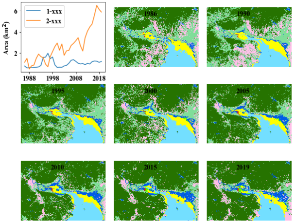

# 第2节 python 读取GEE下载的tif影像并自定义颜色画图显示

## 1 数据说明：

land\_site06.tif 是通过 GEE 处理好的土地利用分类tif格式数据,其中有34个波段，每个波段代表某个年份地物分类情况，一共8种地物类别

## 2 安装对应的包

* 需要先下载: Fiona，Gdal，Pyproj，Shapely的whl文件，然后用pip3 install **\*\*\*.whl**  进行安装
* 下载链接: [https://www.lfd.uci.edu/~gohlke/pythonlibs/\#lxml](https://www.lfd.uci.edu/~gohlke/pythonlibs/#lxml)
* 在安装 Gdal 之前，必须先安装Pyproj、Shapel、yFiona

## 3 结果展示



## 4 代码展示

```python
import gdal 
import numpy as np
import matplotlib.pyplot as plt
import matplotlib.colors as colors
import matplotlib
import pandas as pd

# 控制字体的大小和字体的样式
font = {'family':'Times New Roman', 'weight':'bold', 'size':14}
plt.rcParams['font.sans-serif'] = 'Times New Roman'
plt.rcParams['axes.unicode_minus'] = False
matplotlib.rc('font', **font)

# 自定义颜色
def colormap():
    # color
    cdict = np.array([(255,0,0), (85,255,0), (255,255,0), (115,223,255),(38,115,0),
             (255,190,232),(128,222,153),(0,92,230)])/255 
    # 按照上面定义的colordict，将数据分成对应的部分，indexed：代表顺序
    return colors.ListedColormap(cdict, 'indexed',8)

my_cmap = colormap()

# 读取tif
file = "../data/land_site06.tif"
raster = gdal.Open(file) 
rasterArray = raster.ReadAsArray()

# 统计tif的面积
tmp = {i:(rasterArray.reshape(34,-1)==i).sum(1) for i in range(1,8)}
area = pd.DataFrame(tmp)
area["time"] = range(1986,2020)
area = area.set_index("time",drop=True)

# 画图展示
kw = dict(linewidth = 2,markerfacecolor='none',markersize = 4)
fig, axes = plt.subplots(3, 3, figsize=(10, 8))
axes = axes.ravel()

# 第一个子图是面积变化
h1,h2 = axes[0].plot(area[[1,2]]/1e6*900)
axes[0].set_xticks([1988,1998,2008,2018])
axes[0].legend([h1,h2],['1-xxx','2-xxx'])
axes[0].set_ylabel('Area (km$^2$)')

# 其它小图是空间分布
for index,year in enumerate([1986,1990,1995,2000,2005,2010,2015,2019]):
    band = rasterArray[year-1986,:,:]
    rasterArray[rasterArray==0]=8 # 小问题，0分类也是其它类别
    H = axes[index+1].imshow(band,cmap=my_cmap)
    axes[index+1].set_yticks([])
    axes[index+1].set_xticks([])
    axes[index+1].axis('off')
    title_x = band.shape[0] 
    title_y = band.shape[1]
    axes[index+1].text(title_x/2,title_y*0.1,year)

plt.subplots_adjust(wspace=0.1, hspace=0.1,top = 0.9,bottom = 0.1)
plt.savefig('tif分类数据py.png', dpi=800,format= "png",facecolor=None, edgecolor='Black')
```

### 激励自己，尽可能每周更新1-2篇，2020加油！！！

### 需要交流或者有项目合作可以加微信好友 \(备注GEE\)

### 微信号：comingboy0701

