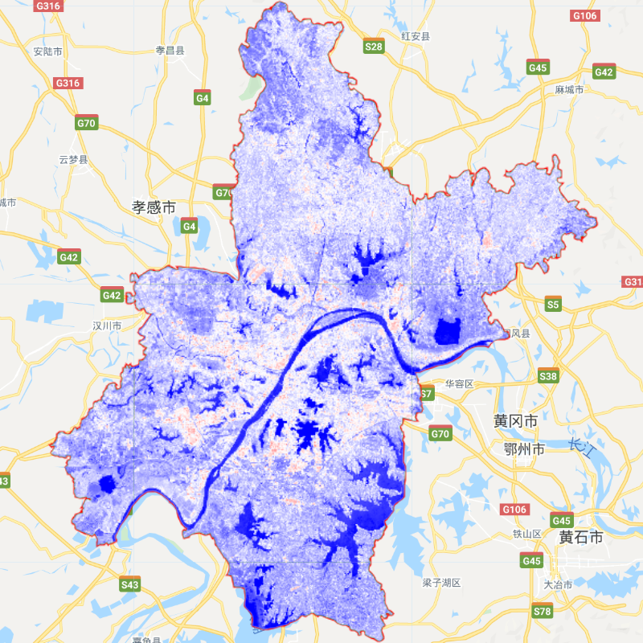
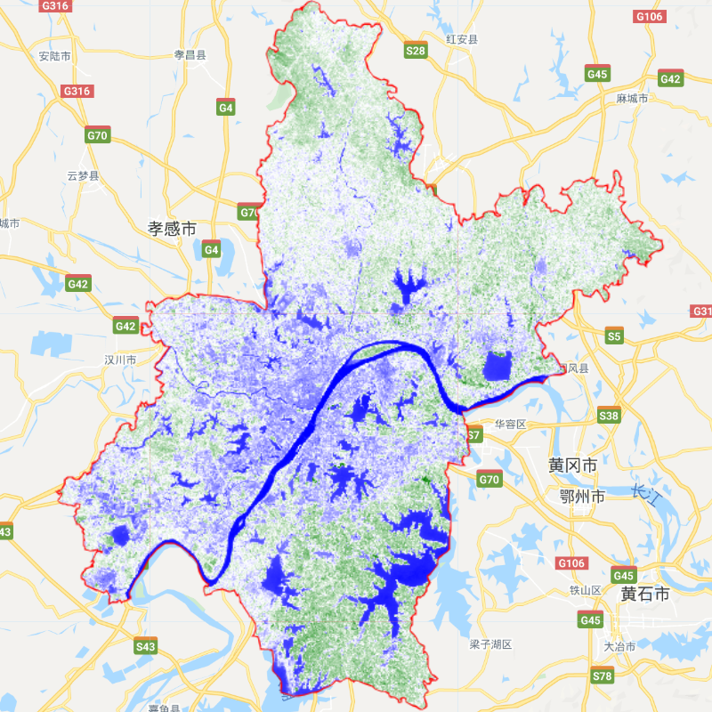
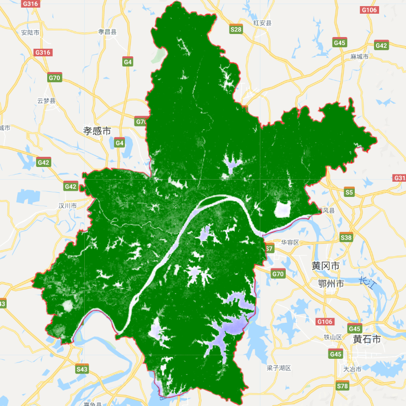

# 第3节 植被指数的三种计算方式expression,normalizedDifference,手动计算

## 1. 数据说明
- 利用哨兵2数据计算武汉市2019年的平均EVI(增强植被指数)，NDWI（水体指数）,NDBI（建筑指数）
- 分别展示expression、normalizedDifference、手动计算三种不同方式计算植被植被指数的用法
## 2. 结果展示

|  |  |  |
| :---: | :---: | :---: |
|  |  |  |
| NDBI | EVI | NDWI |


## 3. 详细代码
```
var roi = ee.FeatureCollection("users/comingboy1118/China/CH_shi");
var roi = roi.filter(ee.Filter.eq("市","武汉市"))
Map.addLayer(roi,{"color":'red',},"roi")
Map.centerObject(roi, 8)
var s2_rmcloud = function(image) {
var quality = image.select("QA60").unmask();
return image.updateMask(quality.eq(0));
};
var image = ee.ImageCollection("COPERNICUS/S2")
    .filterBounds(roi)
    .filterDate('2019-01-01','2019-12-31')
    .map(s2_rmcloud)
    .map(function(image){
      // 方法 1 利用 expression 表达式
      var evi= image.expression(
              '2.5*(NIR-RED)/(NIR+6*RED-7.5*BLUE+10000)',{
              NIR:image.select('B8'),
              RED:image.select('B4'),
              BLUE:image.select('B2'),
            }).float().rename('EVI');   
      // 方法 2 利用 normalizedDifference 归一化函数        
      var ndwi = image.normalizedDifference(['B3','B8']).float().rename('NDWI');      
      // 方法 3 自己手动加减乘除
      var ndbi = image.select('B11').subtract(image.select('B8')).divide(image.select('B11').add(image.select('B8')))
                  .float().rename('NDBI');         
        return ee.Image.cat([evi,ndwi,ndbi]).clip(roi);
      })
      .median();
var visParams = {min: -0.2, max: 0.8, palette: ['blue', 'white','green']};
Map.addLayer(image.select("EVI"), visParams, "EVI");//越绿代表植被越多

var visParams = {min: -0.2, max: 0.8, palette: ['green', 'white','blue']};
Map.addLayer(image.select("NDWI"), visParams, "NDWI");//越蓝代表水越多

var visParams = {min: -0.5, max: 0.5, palette: ['blue', 'white','red']};
Map.addLayer(image.select("NDBI"), visParams, "NDBI");//越红代表建筑越多
```
### <font color=blue> 激励自己，尽可能每周更新1-2篇，2020加油！！！ </font>

### <font color=blue> 需要交流或者有项目合作可以加微信好友 (备注GEE) </font>

### <font color=blue> 微信号：comingboy0701 </font>