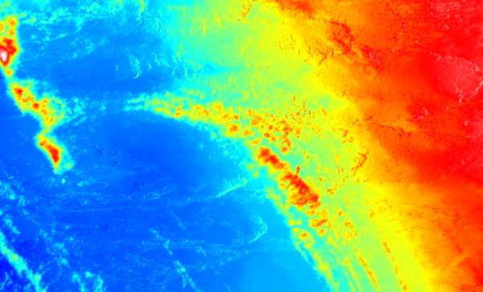

# 第3节 python和matlab对 tif 影像进行读写操作

## 1 假如知道温度和高程的关系，即某个高程对应某个温度，但是现在只有高程数据和这个函数关系，如何画出温度的平面图？

## 2 结果展示



## 3 python 代码

* 安装包的方式和案例2一样

```python
import gdal, ogr, osr, os
import numpy as np

# 读取tif文件变成array
def raster2array(rasterfn):
    raster = gdal.Open(rasterfn)
    band = raster.GetRasterBand(1)
    return band.ReadAsArray()


#把array写入tif
def array2raster(rasterfn,newRasterfn,array):
    raster = gdal.Open(rasterfn)
    geotransform = raster.GetGeoTransform()
    originX = geotransform[0]
    originY = geotransform[3]
    pixelWidth = geotransform[1]
    pixelHeight = geotransform[5]
    cols = raster.RasterXSize
    rows = raster.RasterYSize

    driver = gdal.GetDriverByName('GTiff')
    outRaster = driver.Create(newRasterfn, cols, rows, 1, gdal.GDT_Float32)
    outRaster.SetGeoTransform((originX, pixelWidth, 0, originY, 0, pixelHeight))
    outband = outRaster.GetRasterBand(1)
    outband.WriteArray(array)
    outRasterSRS = osr.SpatialReference()
    outRasterSRS.ImportFromWkt(raster.GetProjectionRef())
    outRaster.SetProjection(outRasterSRS.ExportToWkt())
    outband.FlushCache()


fileone = 'dem.tif'
rasterArray = raster2array(fileone)

# 对dem进行一列的操作,比如映射某种关系,分级.....个人觉得会比 arcgis 栅格计算更方便一些
dem2 = rasterArray;

array2raster(fileone,'dem2.tif',dem2)
```

## 4 matlab 代码

```text
clear;clc;
%读tif文件
file = 'dem.tif';
[A,R]= geotiffread(file);
Ai=geotiffinfo('dem.tif');
% 对dem进行一列的操作,比如映射某种关系,分级.....个人觉得会比 arcgis 栅格计算更方便一些
dem2 = dem;
% 把矩阵数据写入tif
geotiffwrite('dem2.tif',dem2,R,'GeoKeyDirectoryTag',Ai.GeoTIFFTags.GeoKeyDirectoryTag);
```

### 激励自己，尽可能每周更新1-2篇，2020加油！！！

### 需要交流或者有项目合作可以加微信好友 \(备注GEE\)

### 微信号：comingboy0701

