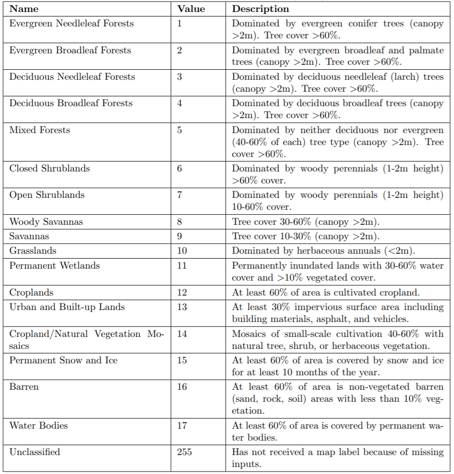
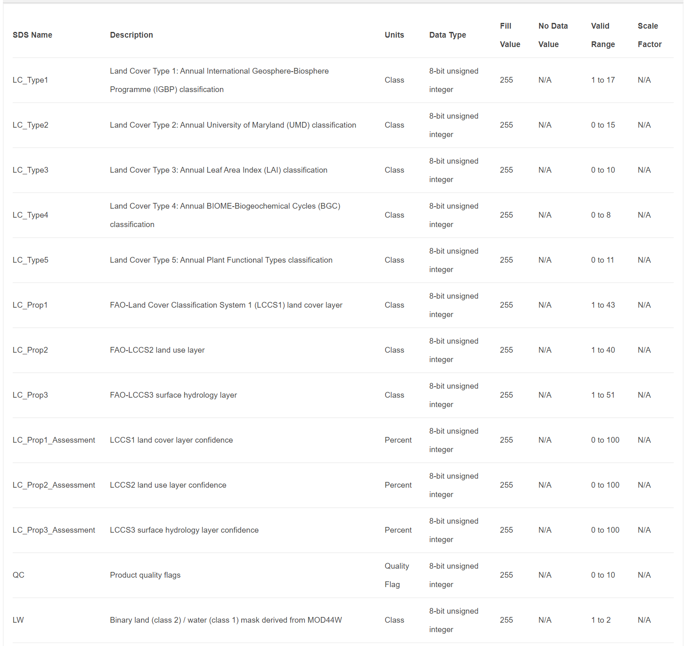
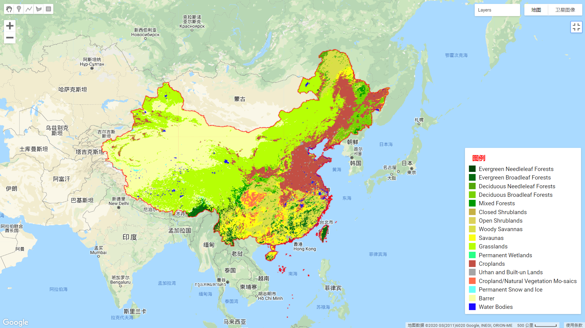
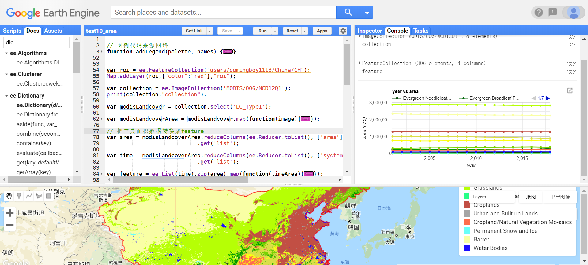

# 第5节 统计不同土地利用类型的面积

## 1. 数据

- 数据来源：https://lpdaac.usgs.gov/products/mcd12q1v006/
- 数据说明：直接利用modis的产品数据**mcd12q1v006**进行统计
- 数据类型如图所示





## 2. 利用LC_Type1这个数据进行统计





## 3. 在GEE上画图展示土地类型情况





## 4. 统计不同土地类型的面积 





## 5. 案例代码
```Javascript
// 图例代码来源网络
function addLegend(palette, names) {
 //图例的底层Panel
 var legend = ui.Panel({
   style: {
     position: 'bottom-right',
     padding: '5px 10px'
   }
 });
 //图例标题
 var title = ui.Label({
   value: '图例',
   style: {
     fontWeight: 'bold',
     color: "red",
     fontSize: '16px'
   }
 });
 legend.add(title);

 //添加每一列图例颜色以及说明
 var addLegendLabel = function(color, name) {
       var showColor = ui.Label({
         style: {
           backgroundColor: '#' + color,
           padding: '8px',
           margin: '0 0 4px 0'
         }
       });


       var desc = ui.Label({
         value: name,
         style: {margin: '0 0 4px 8px'}
       });
     //颜色和说明是水平放置
       return ui.Panel({
         widgets: [showColor, desc],
         layout: ui.Panel.Layout.Flow('horizontal')
       });
 };

 //添加所有的图例列表
 for (var i = 0; i < palette.length; i++) {
   var label = addLegendLabel(palette[i], names[i]);
   legend.add(label);
 }  

 Map.add(legend);
}


var roi = ee.FeatureCollection("users/comingboy1118/China/CH");
Map.addLayer(roi,{"color":"red"},"roi");

var collection = ee.ImageCollection('MODIS/006/MCD12Q1');
print(collection,"collection");

var modisLandcover = collection.select('LC_Type1');

var modisLandcoverArea = modisLandcover.map(function(image){
  var area = ee.Image.pixelArea().addBands(image).reduceRegion({
        reducer: ee.Reducer.sum().group({
          groupField: 1, 
          groupName: "LC_Type1"
        }), 
        geometry: roi, 
        scale: 5000,
        maxPixels:10e15,
      });
      
  var image = image.set({"area":area});
  return image;
});

// 把字典面积数据转换成feature
var area = modisLandcoverArea.reduceColumns(ee.Reducer.toList(), ['area'])
                            .get('list');

var time = modisLandcoverArea.reduceColumns(ee.Reducer.toList(), ['system:time_start'])
                            .get('list');
                            
var feature = ee.List(time).zip(area).map(function(timeArea){
  var time = ee.Date(ee.List(timeArea).get(0)).get("year");
  var area = ee.List(timeArea).get(1);
      area = ee.Dictionary(area).get("groups");
  var feature = ee.List(area).map(function(dict){
      dict = ee.Dictionary(dict);
  var value = dict.values();
    return ee.Feature(null, { 
      time: time,
      land:value.get(0),
      area:value.get(1)});
    });
  return feature;
});

feature = feature.flatten();

var feature = ee.FeatureCollection(feature);

print(feature,"feature");

var palette = [
    '05450a', '086a10', '54a708', '78d203', '009900', 'c6b044', 'dcd159',
    'dade48', 'fbff13', 'b6ff05', '27ff87', 'c24f44', 'a5a5a5', 'ff6d4c',
    '69fff8', 'f9ffa4', '1c0dff'
  ]
var names = [ 'Evergreen Needleleaf Forests',
              'Evergreen Broadleaf Forests',
              'Deciduous Needleleaf Forests',
              'Deciduous Broadleaf Forests',
              'Mixed Forests',
              'Closed Shrublands',
              'Open Shrublands',
              'Woody Savannas',
              'Savaunas',
              'Grasslands',
              'Permanent Wetlands',
              'Croplands',
              'Urhan and Built-un Lands',
              'Cropland/Natural Vegetation Mo-saics',
              'Permanent Snow and Ice',
              'Barrer',
              'Water Bodies']


// 面积统计
var chart = ui.Chart.feature.groups(feature, "time", "area", "land")
.setSeriesNames({1:'Evergreen Needleleaf Forests',
              2:'Evergreen Broadleaf Forests',
              3:'Deciduous Needleleaf Forests',
              4:'Deciduous Broadleaf Forests',
              5:'Mixed Forests',
              6:'Closed Shrublands',
              7:'Open Shrublands',
              8:'Woody Savannas',
              9:'Savaunas',
              10:'Grasslands',
              11:'Permanent Wetlands',
              12:'Croplands',
              13:'Urhan and Built-un Lands',
              14:'Cropland/Natural Vegetation Mo-saics',
              15:'Permanent Snow and Ice',
              16:'Barrer',
              17:'Water Bodies'})
    .setOptions({
      title: 'area vs Landcover',
      hAxis: {'title': 'year'},
      vAxis: {'title': 'area (m^2)'},
      pointSize: 3,
      colors:['#05450a', '#086a10', '#54a708', '#78d203', '#009900', '#c6b044', '#dcd159',
    '#dade48', '#fbff13', '#b6ff05', '#27ff87', '#c24f44', '#a5a5a5', '#ff6d4c',
    '#69fff8', '#f9ffa4', '#1c0dff']
    })

print(chart)
    

// 地图显示
var landcoverVisualization = {palette: palette, min: 1, max: 17, format: 'png'};
Map.setCenter(108, 28, 3);
Map.addLayer(modisLandcover.first().clip(roi), landcoverVisualization, 'MODIS landcover');


//添加图例
addLegend(palette, names);
```

### 激励自己，尽可能每周更新1-2篇，2020加油！！！

### 需要交流或者有项目合作可以加微信好友 \(备注GEE\)

### 微信号：comingboy0701
