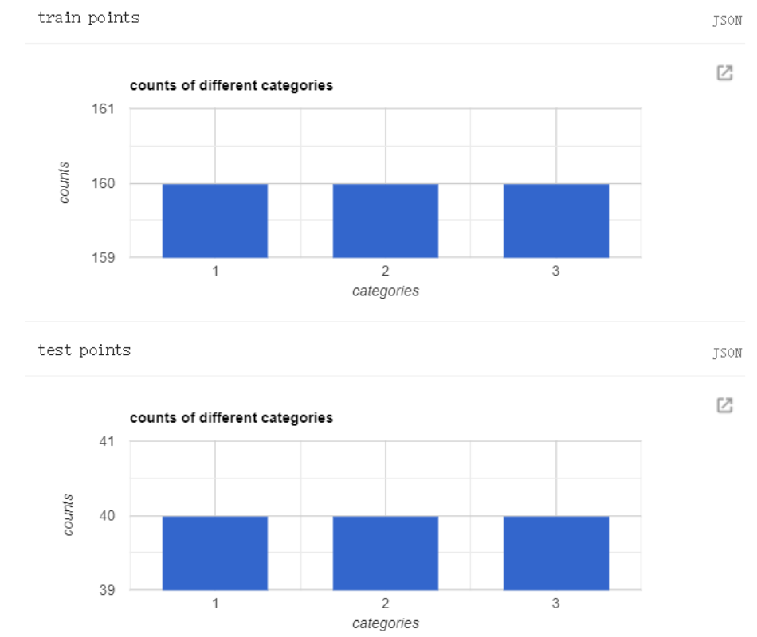
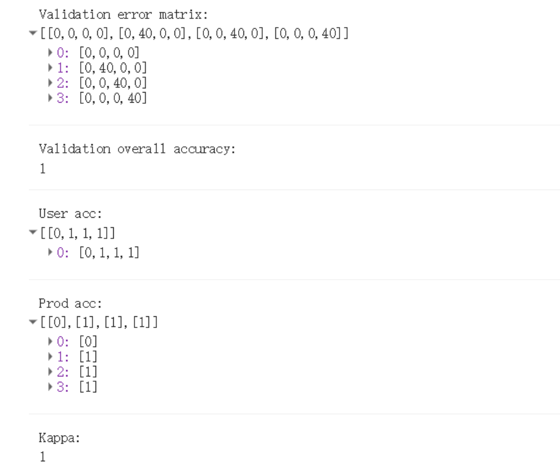

# 第6节 自己数字化训练样本利用SVM进行土地利用分类
## 1 先大概的说一下基本的步骤
- 选取影像
- 数字化训练样本
- 训练模型
- 影像分类
- 验证模型


## 3 利用SVM进行土地利用分类
1.数字化训练样本

|训练和测试样本  |验证结果  | 
| :---: | :---: |
|  | |

2. 分类结果

| 真彩色 | 分类结果 |
| :---: | :---: |
|  |  |


3. 详细代码

```Javascript
// 研究区域
var roi = ee.FeatureCollection("users/comingboy1118/China/CH_shi");
var roi = roi.filter(ee.Filter.eq("市","武汉市"));
Map.addLayer(roi,{"color":'red',},"roi");
Map.centerObject(roi, 8);

// 获取影像
var image = ee.ImageCollection("LANDSAT/LC08/C01/T1_SR")
          .filterBounds(roi)
          .filterDate("2019-01-01","2019-12-31")
          .median()
          .clip(roi);
          
// 选取某些波段用于分类
var bands = ['B2', 'B3', 'B4', 'B5', 'B6', 'B7', 'B10', 'B11'];
var image = image.select(bands);
Map.addLayer(image, {bands: ['B4', 'B3','B2'],min: 0, max: 10000,gamma:3,opacity:1},'image');

// 合并训练的数据（这里使用面，不是用点，为了更快的选取训练数据，点都是一个一个的选取，但是我画一个面就有很多个点数据）
var polygon =ee.FeatureCollection([water,build,other]);

// 通过选取的面，转为点数据，实际其实是根据选取的位置获取图像上的特征
var points = image.sampleRegions({
  collection: polygon,
  properties: ['class'],
  scale: 30
});

// 以下就是纯粹为了选取XXX个点的数据进行训练模型，XXX个点数据进行验证模型
// 备注：有一个bug,如果点的数据少于输入的数据，那这个函数就没有意义了
// split train and test points
var split = function(data,number){
  var tr = data.randomColumn('random', 555) ;
  var train = ee.FeatureCollection([]);
  var test = ee.FeatureCollection([]);
  for(var i =1;i<=3;i++){
    var cate = tr.filter(ee.Filter.eq("class",i)).limit(number,"random");
    var cate_tr = cate.limit(number*0.8,"random",false);
    var cate_test = cate.limit(number*0.2,"random",true);
    train = train.merge(cate_tr);
    test = test.merge(cate_test);
  }
  return [train,test];
};

var train_test = split(points,200);

var train = train_test[0];
var test = train_test[1];

// 统计每类有多少个数据
var figure_histogram = function(points){
  var histogram = ui.Chart.feature.histogram({
  features: points,
  property: "class",
  minBucketWidth:1, 
  maxBuckets:3,
  
  }).setOptions({
    legend: {'position': 'none' },
    title: 'counts of different categories',
    hAxis: {'title': 'categories'},
    vAxis: {'title': 'counts'},
  });
  print(histogram)
  return histogram
}

// 训练数据
figure_histogram(train);

// 验证数据
figure_histogram(test);

// 用默认的参数训练SVM模型
var trained = ee.Classifier.libsvm().train(train,'class',bands)

// 对图像进行分类
var classified = image.select(bands).classify(trained);
Map.addLayer(classified, {min: 1, max: 3, palette: ['blue', 'red','green']}, 'classified');

// 验证模型
var validated = test.classify(trained);
var testAccuracy = validated.errorMatrix('class', 'classification');
var accuracy = testAccuracy.accuracy();
var userAccuracy = testAccuracy.consumersAccuracy();
var producersAccuracy = testAccuracy.producersAccuracy();
var kappa = testAccuracy.kappa();
print('Validation error matrix: ', testAccuracy);
print('Validation overall accuracy: ', accuracy);
print('User acc: ', userAccuracy);
print('Prod acc: ', producersAccuracy);
print('Kappa: ', kappa);

```
4.代码链接
https://code.earthengine.google.com/f34604fd5335128efbcb56755437dde9


### 激励自己，尽可能每周更新1-2篇，2020加油！！！

### 需要交流或者有项目合作可以加微信好友 \(备注GEE\)

### 微信号：comingboy0701