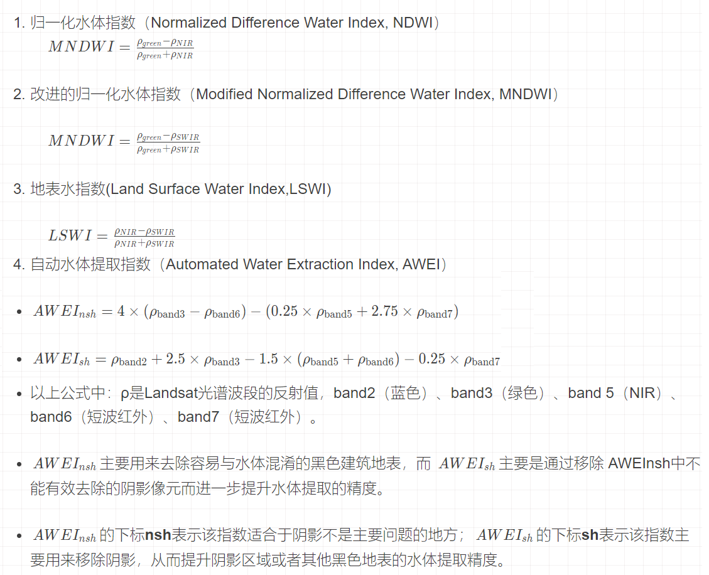
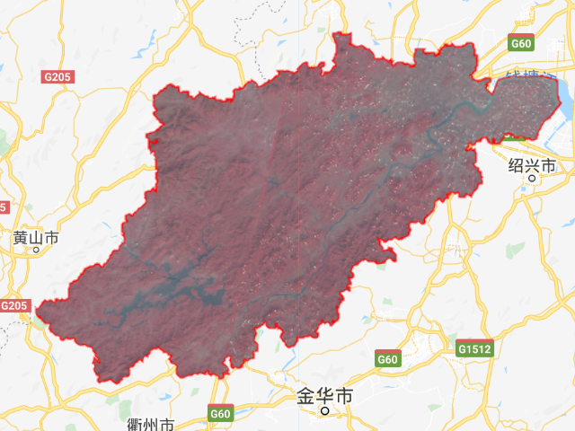
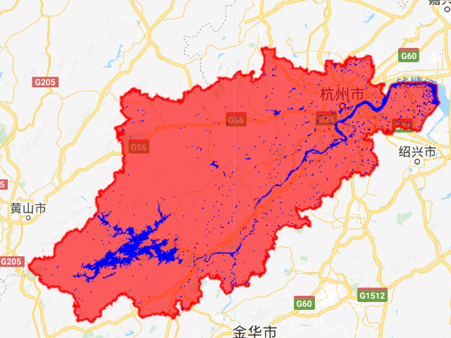

# 第8节 通过阈值法对水体信息进行提取

* 说明： 以下都是通过计算某一种水体指数然后通过控制阈值直接对水体进行提取
* 进一步可以通过监督学习的方法（支持向量机，逻辑回归，随机森林，深度学习……）对水体进行提取，检验水体提取的准确性

## 1 水体指数



## 2 AWEI提取结果

| 假彩色 | 水体 |
| :---: | :---: |
|  |  |

## 3 AWEI提取的详细代码

```python
// 去云
var maskL8 = function(image) {
  var qa = image.select('BQA');
  var mask = qa.bitwiseAnd(1 << 4)
            .or(qa.bitwiseAnd(1 << 8));
  return image.updateMask(mask.not());
};

// 增加水体指数
var addVariables = function(image){
  var awei= image.expression(
              '4*(green-SWIR1)-(0.25*NIR+2.75*SWIR2)',{
              green:image.select('B3'),
              NIR:image.select('B5'),
              SWIR1:image.select('B6'),
              SWIR2:image.select('B7'),
            }).float().rename('AWEI')
  var ndwi = image.normalizedDifference(['B3','B5']).rename('NDWI')
  var mndvi = image.normalizedDifference(['B3','B6']).rename('MNDWI')
  var lswi = image.normalizedDifference(['B5','B6']).rename('LSWI')
  return image.addBands([awei,ndwi,mndvi,lswi]);
}

// 研究区域
var roi = ee.FeatureCollection("users/comingboy1118/China/CH_shi");
var roi = roi.filter(ee.Filter.eq("市","杭州市"))
Map.addLayer(roi,{"color":'red',},"roi")
Map.centerObject(roi, 8)    

var landimg= ee.ImageCollection('LANDSAT/LC08/C01/T1_RT_TOA')
                    .filterBounds(roi)
                    .filterDate('2019-01-31','2019-12-31')
                    .map(maskL8)
                    .map(addVariables)
                    .mosaic()
                    .clip(roi)
// 真彩色          
Map.addLayer(landimg, {bands: ['B5', 'B4','B3'],min: 0, max: 1,gamma:3,opacity:1},'landimg');

//显示水体指数
var visParams = {min: -0.8, max: 0.8, palette: [ 'green','white','blue']};
Map.addLayer(landimg.select('AWEI'),visParams,'AWEI');
Map.addLayer(landimg.select('NDWI'),visParams,'NDWI');
Map.addLayer(landimg.select('MNDWI'),visParams,'MNDWI');
Map.addLayer(landimg.select('LSWI'),visParams,'LSWI');

// 通过阈值提取水体
var ALOSDEM = ee.Image("JAXA/ALOS/AW3D30_V1_1");
var slope = ee.Terrain.slope(ALOSDEM.clip(roi));
var AWEI = landimg.select('AWEI');
var water=AWEI.gt(-0.005).updateMask(slope.lt(10)); //snow and shadow mask by DEM data 
var water=water.updateMask(water.gt(0.5));
Map.addLayer(water,{min: 0, max: 1,palette: ['white','blue']},'water');

//其它监督学习方法提取然后进行检验--
// 哎呀，接下来我也不会了，要不有读者给我讲讲
```

## 4 代码链接

[https://code.earthengine.google.com/b0f0e978efca54720721715e90ece2e3](https://code.earthengine.google.com/b0f0e978efca54720721715e90ece2e3)

### 激励自己，尽可能每周更新1-2篇，2020加油！！！

### 需要交流或者有项目合作可以加微信好友 \(备注GEE\)

### 微信号：comingboy0701

