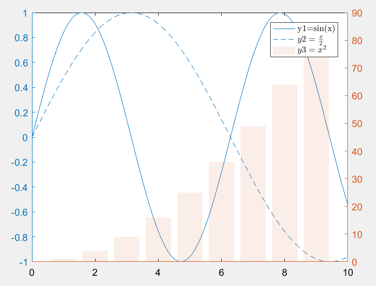

# 第1节 matlab画图01-双纵轴

## 1 根据文档注明，尽量用 yyaxis,少用plotyy

* 版本号：matlab2016a

```python
x = linspace(0,10);
yl1 = sin(x);
yl2 = sin(x/2);
yyaxis left
plot(x,yl1)
hold on
plot(x,yl2)

x = linspace(1,9,9);
yr = x.^2;
yyaxis right
ax = gca;
c = ax.YAxis(2).Color;
bar(x,yr,'FaceColor',c,'EdgeColor','None','FaceAlpha',0.1)
set(gca,'xcolor','k');
h=legend({'y1=sin(x)','$y2=\frac{x}{2}$','$y3={x}^{2}$'}); %latex分式
set(h,'Interpreter','latex')
```

## 2 画图结果



