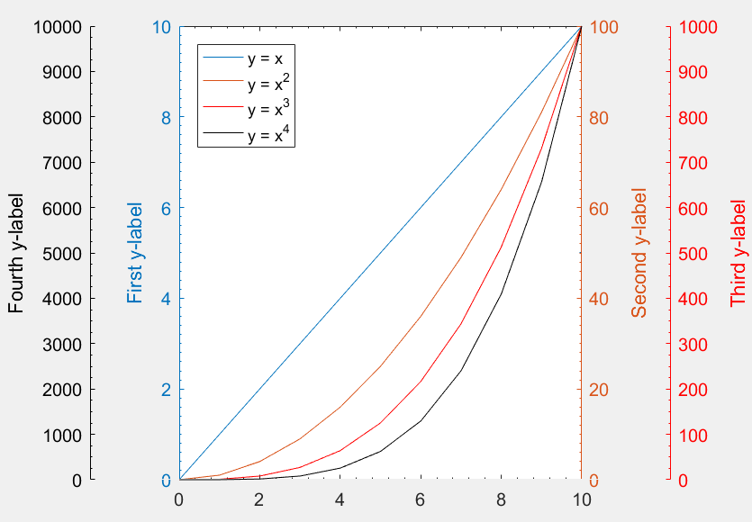

# 第2节 matlab画图02-四纵轴

## 1 详细代码

* 版本号：matlab2016a

```python
function [ax,hlines] = ploty4(x1,y1,x2,y2,x3,y3,x4,y4,ylabels)
%PLOTY4     Extends plotyy to include a third and fourth y-axis
%
% Syntax:   [ax,hlines] = ploty4(x1,y1,x2,y2,x3,y3,x4,y4,ylabels)
%
% Inputs:   x1,y1 are the xdata and ydata for the first axes' line
%           x2,y2 are the xdata and ydata for the second axes' line
%           x3,y3 are the xdata and ydata for the third axes' line
%           x4,y4 are the xdata and ydata for the fourth axes' line
%           ylabels is a 4x1 cell array containing the ylabel strings (optional)
%
% Outputs:  ax -        4x1 double array containing the axes' handles
%           hlines -    4x1 double array containing the lines' handles
%
% Example:
%           x = 0:10;
%           y1=x;  y2=x.^2;  y3=x.^3;  y4=x.^4;
%           ylabels{1} = 'First y-label';
%           ylabels{2} = 'Second y-label';
%           ylabels{3} = 'Third y-label';
%           ylabels{4} = 'Fourth y-label';
%           [ax,hlines] = ploty4(x,y1,x,y2,x,y3,x,y4,ylabels);
%           leghandle = legend(hlines, 'y = x','y = x^2','y = x^3','y = x^4',2);
%
% See also Plot, Plotyy

% Based on plotyyy.m (available at www.matlabcentral.com) by :
% Denis Gilbert, Ph.D.


% Check inputs
msg=nargchk(8,9,nargin);
error(msg);

% Create figure window
figure('units','normalized',...
       'DefaultAxesXMinorTick','on','DefaultAxesYminorTick','on');

%Plot the first two lines with plotyy
[ax,hlines(1),hlines(2)] = plotyy(x1,y1,x2,y2);
cfig = get(gcf,'color');
pos = [0.125 0.1 0.65 0.8];
offset = pos(3)/5.5;

%Reduce width of the two axes generated by plotyy
pos(1) = pos(1) + offset;
pos(3) = pos(3) - offset;
set(ax,'position',pos);

%Determine the position of the third/fourth axes
pos3 = [pos(1) pos(2) pos(3)+offset pos(4)];
pos4 = [pos(1) - offset pos(2) pos(3)+offset pos(4)];

%Determine the proper x-limits for the third and fourth axes
scale3 = pos3(3)/pos(3);
scale4 = pos4(3)/pos(3);
limx1 = get(ax(1),'xlim');
limx3 = [limx1(1) limx1(1)+scale3*(limx1(2)-limx1(1))];
limx4 = [limx1(2)-scale4*(limx1(2)-limx1(1)) limx1(2)];

%Create ax(3) & ax(4)
ax(3) = axes('Position',pos3,'box','off',...
   'Color','none','XColor',cfig,'YColor','r',...
   'xtick',[],'xlim',limx3,'yaxislocation','right');
ax(4) = axes('Position',pos4,'box','off',...
   'Color','none','XColor',cfig,'YColor','k',...
   'xtick',[],'xlim',limx4,'yaxislocation','left');

%Plot x3,y3,x4,y4
hlines(3) = line(x3,y3,'Color','r','Parent',ax(3));
hlines(4) = line(x4,y4,'Color','k','Parent',ax(4));

%Put ax(2) on top;
axes(ax(2));

%Set y-labels;
% if nargin==9
% set(cell2mat(get(ax,{'ylabel'})),{'String'},{ylabels{:}}');
for i =1:length(ylabels)
    set(get(ax(i),'ylabel'),'string',ylabels{i})
end
end
```

## 2  example

```python
x = 0:10;
y1=x;  y2=x.^2;  y3=x.^3;  y4=x.^4;
ylabels{1} = 'First y-label';
ylabels{2} = 'Second y-label';
ylabels{3} = 'Third y-label';
ylabels{4} = 'Fourth y-label';
[ax,hlines] = ploty4(x,y1,x,y2,x,y3,x,y4,ylabels);
leghandle = legend(hlines, 'y = x','y = x^2','y = x^3','y = x^4','location','northwest');
```

## 3 画图结果



