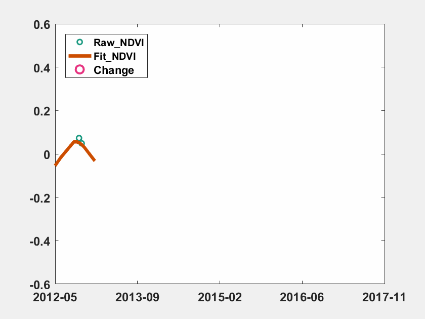

# 第3节 matlab画图03-gif|avi


### 1 数据说明
以下是对遥感图像进行时序处理，识别土地利用类型的变化的过程变化

为了方便展示，我把tif的图像变成了excel数据

由于这里只讲matlab作图，想详细了解以下方法的数据来源和处理，可以私聊


### 2 结果展示



上图结果中，绿色圈圈代表遥感影像实际的观测值，棕色的线代码按照某种模型进行拟合，红色的圈圈代表拟合的线和实际观测的值持续3次相差太大，说明土地利用类型发生了变化，需要改变拟合的线


### 4 详细代码

```python
file = 'spartina.xls';
[data,txt,raw]= xlsread(file);
time  = datenum(txt(2:end,1));
color = [0.1, 0.6, 0.5;0.8, 0.3, 0.0;0.9, 0.2, 0.5];

clf;
figure (1);
for i=25: size(data,1)-25 %为了展示更好的效果，去除了前25个数据和最后25个数据
    tmp = data(1:i,:);
    tmp2 = time(1:i);
    h1 = plot(tmp2, tmp(:,2),'o','color',color(1,:),'MarkerSize',5,'linewidth',1.5);
    hold on
    h2 = plot(tmp2, tmp(:,6),'-','color',color(2,:),'MarkerSize',5,'linewidth',3);
    hold on
    h3 = plot(tmp2, tmp(:,12),'o','color',color(3,:),'MarkerSize',8,'linewidth',2);
    set(gca,'xlim',[min(time),max(time)]);
    datetick('x','yyyy-mm','keepticks');
    set(gca,'ylim',[-0.6,0.6],'FontSize',12,'FontWeight','bold');
    set(gca,'ytick',[-0.6,-0.4,-0.2,0,0.2,0.4,0.6],'FontSize',12,'FontWeight','bold');
    legend([h1,h2,h3],{'Raw\_NDVI','Fit\_NDVI','Change'},'location','northwest')
    f(i-24) = getframe(gcf);
    frame=getframe(gcf);
    im=frame2im(frame);%制作gif文件，图像必须是index索引图像
    [I,map]=rgb2ind(im,256);
    if i-24 == 1;
        imwrite(I,map,'test02_spartina.gif','gif', 'Loopcount',inf);
    else
        imwrite(I,map,'test02_spartina.gif','gif','WriteMode','Append');
    end
end
movie2avi(f,'test02_spartina.avi','fps',15,'quality',1,'compression', 'None'); 

```

### 激励自己，尽可能每周更新1-2篇，2020加油！！！

### 需要交流或者有项目合作可以加微信好友 \(备注matlab\)

### 微信号：comingboy0701

```python

```
