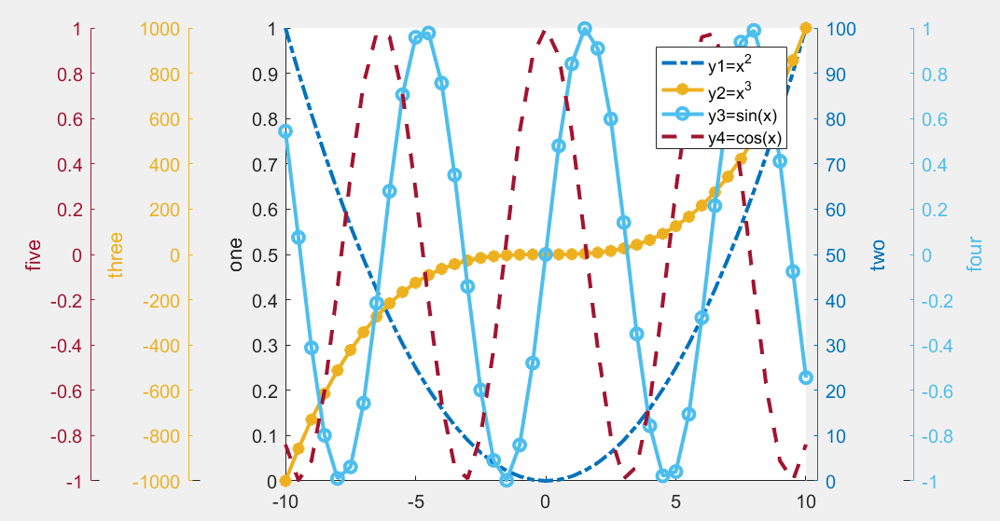

# 第3节 matlab画图03-多纵轴

## 1 详细代码

* 版本号：matlab2016a
* 详细链接：[https://www.mathworks.com/matlabcentral/fileexchange/9016-addaxis](https://www.mathworks.com/matlabcentral/fileexchange/9016-addaxis)
* 备注：我的版本号是matlab2016a,对于此工具箱稍微做了修改，需要的到[github](https://github.com/comingboy0701/GEE-learning)下载

## 2 测试用例-example

```python
x = -10:0.5:10;
y1 = x.^2;
y2 = x.^3;
y3 = sin(x);
y4 = cos(x);

addaxis(x, y1,'-.','linewidth',2)
addaxis(x, y2,'-*','linewidth',2) 
addaxis(x, y3,'-o','linewidth',2) 
addaxis(x, y4,'--','linewidth',2)

addaxislabel(1,'one'); 
addaxislabel(2,'two'); 
addaxislabel(3,'three');
addaxislabel(4,'four');
addaxislabel(5,'five');
legend({'y1=x^2','y2=x^3','y3=sin(x)','y4=cos(x)'})
```

## 3 结果显示



