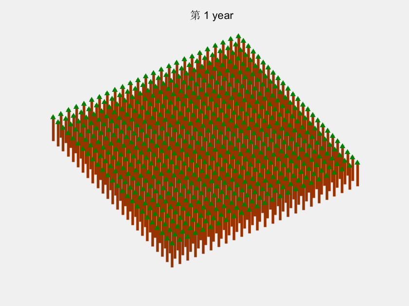

# 第6节 matlab画图06-gif\|avi

## 1 数据说明

以下是刚入门matlab时做的一个森林模型， 1. 更好的展示森林生长的过程 2. 熟悉使用matlab作图

## 2 结果展示



## 3 详细代码

```python
%方法1
clear;clc;
figure (1)
load('mangrove') %载入数据
for k=1:51
%     subplot(2,2,k) %画子图N
    A=dbh_ty{1,k}{1, 1};% 提取相应年份的数据
    A=A(1:2:50,1:2:50);
    A(A==0)=nan;%把半径都是0的都变成nan
    b2=48.04;%高度和胸径的关系常数b2 
    b3=0.172;%高度和胸径的关系常数b3
    H=137+b2*(A.*2)-b3*(A.*2).^2;%高度和胸径的比例关系            
    [xx,yy]=meshgrid(1:25,1:25);%产生50*50的矩阵
    xx(isnan(A))=nan;%把半径为nan的相对应点都变成nan
    yy(isnan(A))=nan;%把半径为nan的相对应点都变成nan
    H(isnan(A))=nan;%把半径为nan的高度都变成nan
    stem3(yy,xx,H./10,'MarkerFaceColor',[0 0.5 0],... %画火柴图
        'MarkerEdgeColor',[0 0.5 0],...
        'MarkerSize',nanmean(nanmean(A)).*25,...
        'Marker','^',...
        'LineWidth',nanmean(nanmean(H))./50,...
        'Color',[0.6 0.2 0]);
     title(['第',' ',num2str(k),' ','year'])%加上标题   
    view([-122.7 78]); %侧视; 
%     view([-90, 90]); %俯视
%     view([190 0]);%平视
    axis off %去除网格
    axis off %去除网格
    f(k) = getframe(gcf);
    frame=getframe(gcf);
    im=frame2im(frame);%制作gif文件，图像必须是index索引图像
    [I,map]=rgb2ind(im,256);
    if k == 1;
        imwrite(I,map,'test01_mangrove.gif','gif', 'Loopcount',inf);
    else
        imwrite(I,map,'test01_mangrove.gif','gif','WriteMode','Append');
    end
%     pause(0.5)
end
movie2avi(f,'test01_mangrove.avi','fps',5,'quality',100,'compression', 'None');
```

## 激励自己，尽可能每周更新1-2篇，2020加油！！！

## 需要交流或者有项目合作可以加微信好友 \(备注matlab\)

## 微信号：comingboy0701

```python

```

