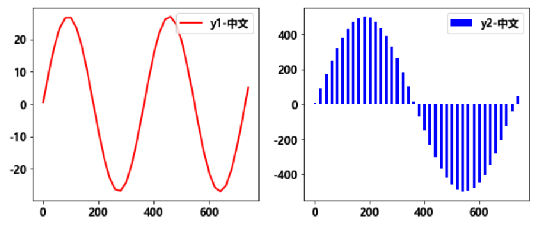
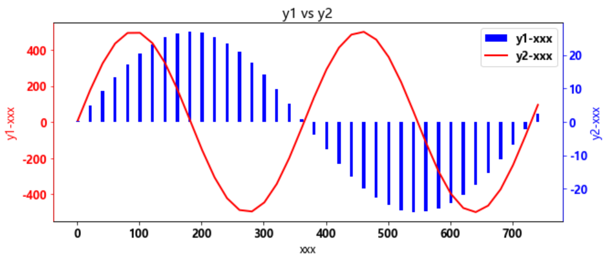

# 第1节 python画图01-双纵轴

## 1 导入需要的库

```python
import matplotlib.pyplot as plt
import numpy as np
import matplotlib
# 设置中文显示
font = {'family':'Microsoft YaHei', 'weight':'bold', 'size':12}
plt.rcParams['font.sans-serif'] = 'Microsoft YaHei'
plt.rcParams['axes.unicode_minus'] = False
matplotlib.rc('font', **font)
```

## 2 构造数据

```python
x = np.arange(1,750,20)
y1 = np.sin(2*np.pi/365*x)*27
y2 = np.sin(2*np.pi/(365*2)*x)*500
```

## 3 画图显示数据

```python
fig = plt.figure(figsize=(10, 4))
ax = fig.add_subplot(1,2,1)
ax.plot(x,y1,'r-',linewidth=2,label='y1-中文')
ax.legend()

ax = fig.add_subplot(1,2,2)
ax.bar(x,y2,width=10,color='b',label='y2-中文')
ax.legend()
```



## 4 双纵坐标显示数据

```python
fig = plt.figure(figsize=(10, 4))
ax = fig.add_subplot(1,1,1)

h1 =ax.bar(x,y2,width=5,color='b',label='y2-中文')
ax.set_ylabel('y1-xxx')
ax.set_title("y1 vs y2")  
ax.set_xlabel('xxx')

ax2 = ax.twinx()
h2, = ax2.plot(x,y1,'r-',linewidth=2,label='y1-中文')
ax2.set_ylabel('y2-xxx')

ax2.spines['left'].set_color('r')
ax2.spines['right'].set_color('b')
ax.tick_params(axis='y', colors='r')
ax2.tick_params(axis='y', colors='b')
ax.yaxis.label.set_color('r')
ax2.yaxis.label.set_color('b')

ax.legend([h1,h2],['y1-xxx','y2-xxx'])
```



