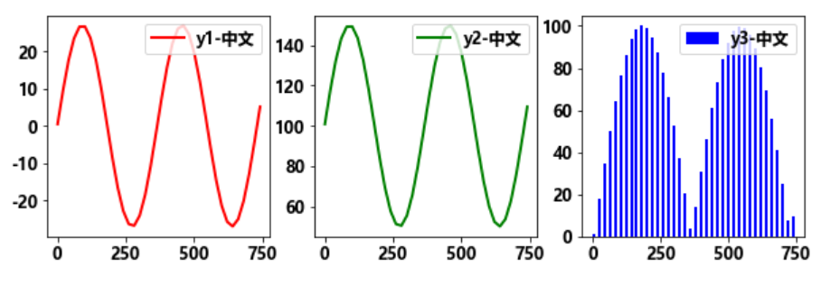
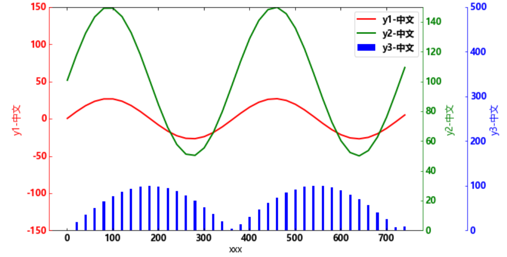

# 第2节 python画图02-三纵轴


## 1 导入需要的库

```python
from mpl_toolkits.axisartist.parasite_axes import HostAxes, ParasiteAxes
import matplotlib.pyplot as plt
import matplotlib
import numpy as np
# 设置中文显示
font = {'family':'Microsoft YaHei', 'weight':'bold', 'size':12}
plt.rcParams['font.sans-serif'] = 'Microsoft YaHei'
plt.rcParams['axes.unicode_minus'] = False
matplotlib.rc('font', **font)
```

## 2 构造数据

```python
x = np.arange(1,750,20)
y1 = np.sin(2*np.pi/365*x)*27
y2 = np.sin(2*np.pi/365*x)*50+100
y3 = abs(np.sin(2*np.pi/(365*2)*x)*100)
```

## 3 画图显示数据

```python
fig = plt.figure(figsize=(10, 3))
ax = fig.add_subplot(1,3,1)
ax.plot(x,y1,'r-',linewidth=2,label='y1-中文')
ax.legend(loc="upper right")

ax = fig.add_subplot(1,3,2)
ax.plot(x,y2,'g-',linewidth=2,label='y2-中文')
ax.legend(loc="upper right")

ax = fig.add_subplot(1,3,3)
ax.bar(x,y3,width=10,color='b',label='y3-中文')
ax.legend(loc="upper right")
```




## 4 三纵坐轴显示数据

```python
fig = plt.figure(figsize=(10, 6)) 
ax = HostAxes(fig, [0.1, 0.1, 0.7, 0.7])  #用[left, bottom, weight, height]的方式定义axes, 0 <= l,b,w,h <= 1
kw = dict(linewidth = 2,markerfacecolor='none',markersize = 4)

#parasite addtional axes, share x
ax02 = ParasiteAxes(ax, sharex=ax)
ax03 = ParasiteAxes(ax, sharex=ax)

#append axes
ax.parasites.append(ax02)
ax.parasites.append(ax03)

ax03_axisline = ax02.get_grid_helper().new_fixed_axis
ax03.axis['right4'] = ax03_axisline(loc='right', axes=ax03, offset=(60,0))


fig.add_axes(ax)
h1, = ax.plot(x, y1, linewidth=2,color='r',label="y1-中文")
h2, = ax02.plot(x, y2, linewidth=2,color='g',label="y2-中文")
h3 = ax03.bar(x,y3,width=5,color='b',label='y3-中文')

#invisible right axis of ax
ax.axis['right'].set_visible(False)
ax.axis['top'].set_visible(True)
ax02.axis['right'].set_visible(True)
ax02.axis['right'].major_ticklabels.set_visible(True)
ax02.axis['right'].label.set_visible(True)

#set label for axis
ax.set_ylabel('y1-中文')
ax.set_xlabel('xxx')
ax02.set_ylabel('y2-中文')
ax03.set_ylabel('y3-中文')

#set xlim for yaxis
ax.set_ylim(-150,150)
ax02.set_ylim(0,150)
ax03.set_ylim(0,500)

ax.legend()

#name axies, xticks colors
ax.axis['left'].label.set_color('r')
ax02.axis['right'].label.set_color('g')
ax03.axis['right4'].label.set_color('b')

ax.axis['left'].major_ticks.set_color('r')
ax02.axis['right'].major_ticks.set_color('g')
ax03.axis['right4'].major_ticks.set_color('b')

ax.axis['left'].major_ticklabels.set_color('r')
ax02.axis['right'].major_ticklabels.set_color('g')
ax03.axis['right4'].major_ticklabels.set_color('b')

ax.axis['left'].line.set_color('r')
ax02.axis['right'].line.set_color('g')
ax03.axis['right4'].line.set_color('b')
```



```python

```
