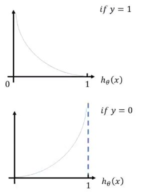

# 第2.1节 经典机器学习-线性回归与逻辑回归


## 1 线性回归


虽然可以直接求导，但是如果维度太大，还是选择梯度下降

loss: $J(\theta)=\frac{1}{2 m} \sum_{i=1}^{m}\left(h_{\theta}\left(x^{i}\right)-y^{i}\right)^{2}$

Gradient Descent:

$ \frac{\partial}{\partial \theta_{j}} J\left(\theta_{j}\right)=\frac{1}{m} \sum_{i=1}^{m}\left(h_{\theta}\left(x^{i}\right)-y^{i}\right) \cdot x_{j} $


## 2 逻辑回归


Hypothesis: $h_{\theta}(x)=\frac{1}{1+e^{-\theta^{T} x}}$

loss: $J(\theta)=\left[\begin{array}{ll}
-\log \left(h_{\theta}(x)\right) & \text { if } y=1 \\
-\log \left(1-h_{\theta}(x)\right) & \text { if } y=0
\end{array}\right.$

loss: $ J(\theta)=-y \log \left(h_{\theta}(x)\right)-(1-y) \log \left(1-h_{\theta}(x)\right)$


loss 画图显示



Gradient Descent:

$ \frac{\partial}{\partial \theta_{j}} J\left(\theta_{j}\right)=\frac{1}{m} \sum_{i=1}^{m}\left(h_{\theta}\left(x^{i}\right)-y^{i}\right) \cdot x_{j} $

```python

```
