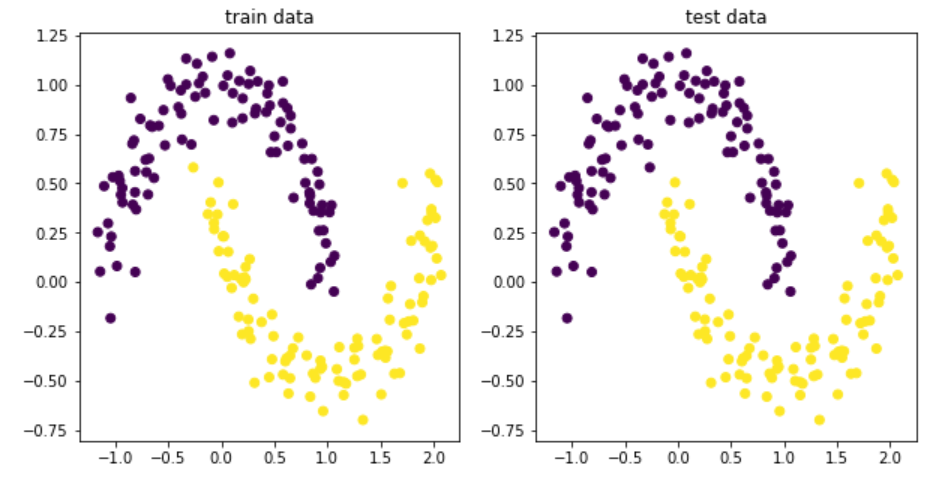

# 第2.2节 经典机器学习-神经网络、反向传播算法以及正则化


## 1 监督学习

激活函数：加入非线性关系


## 2 反向传播


## 3 前向传播


## 4 链式传播的一些问题

梯度消失：只用sigmod函数，一般不超过三层


## 5 正则化


**Linear Regression:**

$J(\theta)=\frac{1}{2 m}\left[\sum_{i=1}^{m}\left(h_{\theta}\left(x^{i}\right)-y^{i}\right)^{2}+\lambda \sum_{j=1}^{n} \theta_{j}^{2}\right]$

Gradient Descent:

$\theta_{j}=\theta_{j}-\alpha\left[\frac{1}{m} \sum_{i=1}^{m}\left(h_{\theta}\left(x^{i}\right)-y^{i}\right) \cdot x^{i}+\frac{\lambda}{m} \theta_{j}\right]$

$\theta_{j} = \theta_{j}(1-\alpha\frac{\lambda}{m})-\alpha\frac{1}{m}\sum\left(h_{\theta}\left(x^i\right)-y^i\right)\cdot x^i$

**Logistic Regression:**

$J(\theta)=-\frac{1}{m} \sum_{i=1}^{m}\left[y^{i} \log \left(h_{\theta}\left(x^{i}\right)\right)+\left(1-y^{i}\right) \log \left(1-h_{\theta}\left(x^{i}\right)\right)\right]+\frac{\lambda}{2 m} \sum_{j=1}^{n} \theta_{j}^{2}$


**L1** 和 **L2** 正则化

Lp Norm: $\left(\sum|\theta_{i}^p|\right)^{\frac{1}{p}}$

L1 regularzation：$||\theta||^2$   **Ridge Regression**

计算效率快

结果不是稀疏矩阵

不能做特征选择

L2 regularzation:$||\theta||$  **Lasso Regression**

计算效率慢

产生稀疏矩阵的结果

可以做特征选择


## 6 神经网络

```python
import numpy as np
import sklearn.datasets
import sklearn.linear_model
import matplotlib.pyplot as plt

# 生成数据集
np.random.seed(0)
X, y = sklearn.datasets.make_moons(200, noise=0.1)
plt.figure(figsize=(10,5))
plt.subplot(1, 2, 1)
plt.title("train data")
plt.scatter(X[:, 0], X[:, 1], c=y)


num_examples = len(X)  # size of training set
nn_input_dim = 2
nn_output_dim = 2

lr = 0.01
reg_lambda = 0.01


def calculate_loss(model):
    W1, b1, W2, b2 = model['W1'], model['b1'], model['W2'], model['b2']
    z1 = X.dot(W1) + b1
    a1 = np.tanh(z1)

    z2 = a1.dot(W2) + b2

    exp_scores = np.exp(z2)
    probs = exp_scores / np.sum(exp_scores, axis=1, keepdims=True)

    log_probs = -np.log(probs[range(num_examples), y])
    loss = np.sum(log_probs)

    return 1. / num_examples * loss


def build_model(nn_hdim, num_passes=30000, print_loss=False):
    W1 = np.random.randn(nn_input_dim, nn_hdim) / np.sqrt(nn_input_dim)
    b1 = np.zeros((1, nn_hdim))
    W2 = np.random.randn(nn_hdim, nn_output_dim) / np.sqrt(nn_hdim)
    b2 = np.zeros((1, nn_output_dim))

    model = {}

    # Gradient descent.
    for i in range(0, num_passes):
        # forward
        z1 = X.dot(W1) + b1
        a1 = np.tanh(z1)
        z2 = a1.dot(W2) + b2
        exp_scores = np.exp(z2)
        probs = exp_scores / np.sum(exp_scores, axis=1, keepdims=True)  # this is softmax

        # bp
        delta3 = probs
        delta3[range(num_examples), y] -= 1  # this is the derivative of softmax [no need to thoroughly understand yet]
        #                                   [we'll revisit in weeks later]
        dW2 = (a1.T).dot(delta3)
        db2 = np.sum(delta3, axis=0, keepdims=True)
        delta2 = delta3.dot(W2.T) * (1 - np.power(a1, 2))  # tanh derivative
        dW1 = np.dot(X.T, delta2)
        db1 = np.sum(delta2, axis=0)

        # optional
        W1 += -lr * dW1/num_examples
        b1 += -lr * db1/num_examples
        W2 += -lr * dW2/num_examples
        b2 += -lr * db2/num_examples

        model = {'W1': W1, 'b1': b1, 'W2': W2, 'b2': b2}

        if print_loss and i % 1000 == 0:
            print("Loss after iteration %i: %f" % (i, calculate_loss(model)))
    return model

def predict(model):
    W1, b1, W2, b2 = model['W1'], model['b1'], model['W2'], model['b2']
    z1 = X.dot(W1) + b1
    a1 = np.tanh(z1)

    z2 = a1.dot(W2) + b2

    exp_scores = np.exp(z2)
    probs = exp_scores / np.sum(exp_scores, axis=1, keepdims=True)
    return np.argmax(probs, axis=1)

# n-dimesional hidden layer
model = build_model(10, print_loss=True)

plt.subplot(1,2,2)
plt.scatter(X[:, 0], X[:, 1], c=predict(model))
plt.title("test data")
plt.show()
```



```python

```
