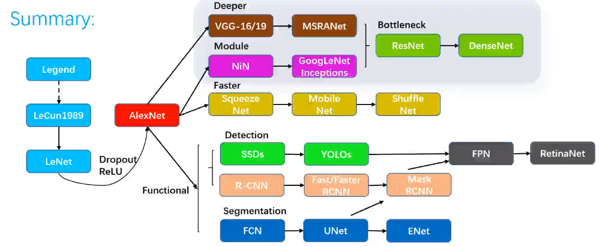
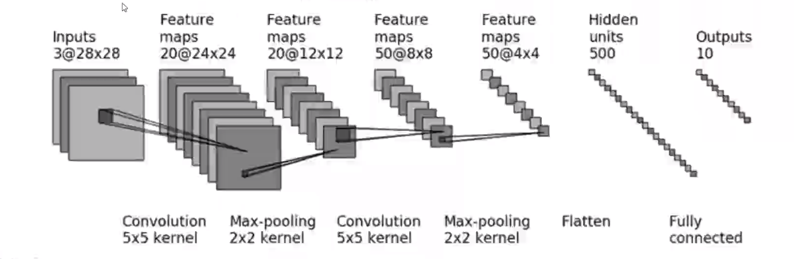
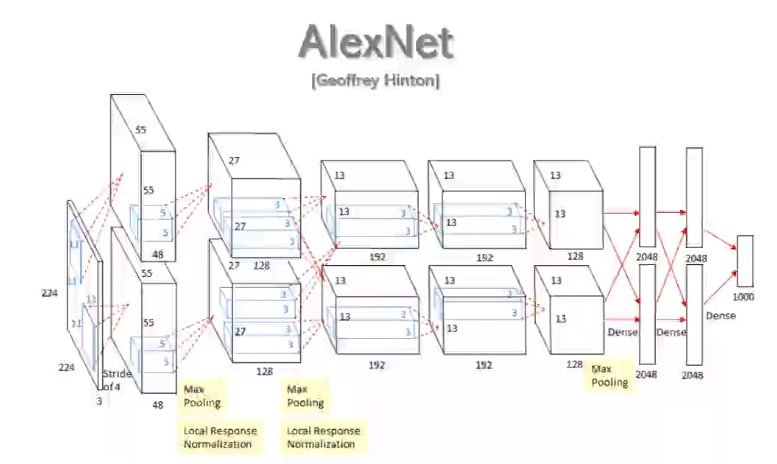
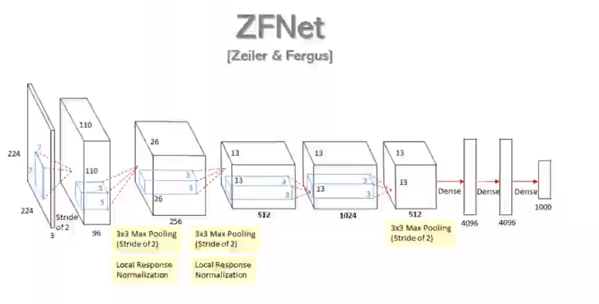
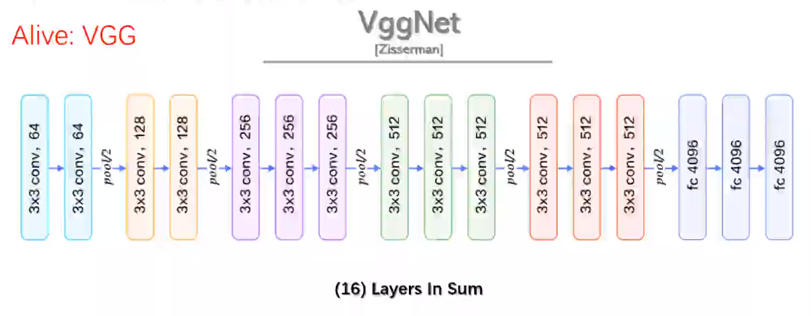
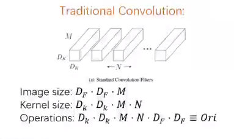
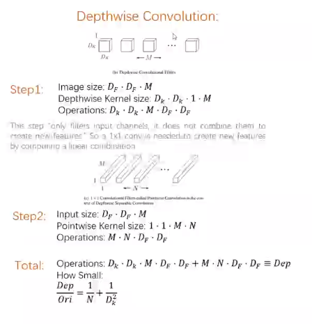

# 第3.1节 CNN综述：层





## 1. Net Framework


### A. Classic Frameworks


**LeNet-5(Yann LeCun)**




**AlexNet(Geoffrey Hinton)**



**ZFNet(Zeiler&Ferous)**



**Empirical Formula:**

Input -n×(Conv-ReLu-Max Pool) -1|2×FC-Output


**VggNet(Zisseman)**


why 3×3 kernel? 多个小的的kernel和一个大的kernel看的视野一样，但是参数更少

why max pooling?
找到极值点、图像resize、计算量变小


**GoogleNet**


1×1 Con:reduce dimension

Inception Module:multiple resolution

Global Ave Pool:better result than FC

Auxiliary Softmax:weighted assemble loss less overfit


**ResNet(Kaming He)**:


**DenseNet**：说明层数往后越来越重要


### B. Light Frameworks


Ideas for acceleration:

- Optimize net framework: Shuffle Net
    
- Decrease # of parameters: Squeeze Net

- Optimize Conv:$\left\{
\begin{aligned}
Order of computation: Mobile Net \\
Method of computation: Winograd \\
\end{aligned}
\right.$

- Delete FC: Squeeze Net， LightCNN


**MoblieNet-V1**

Traditional COnvolution:



Depthwise Convolution:




**MoblieNet-V1**


**ShuffleNet-V2**

Guidelines

1. MAC(Memony access cost) becomes minimal when input/output has same the size

2. Excessive Gconv increases MAC

3. Network fragmentation reduces degree of parallelism

4. Eltwise operations are non-negligible


## 2. FLOPS


Meaning: floating-point operations
    
Input Tensor:$H×W×C_{in}$
    
Output Tensor:$H×W×C_{out}$
    
Kernel Size: $K_{w} × K_{h}$
    
\# of parameters:$(K_{w} × K_{h} ×C_{in})× C_{out}+×C_{out}=N_{p}$  

**FLOPs**:$[(K_{w} × K_{h} ×C_{in})× C_{out}]+×C_{out})×H×W=N_{p}×H×W$
    

```python
 
```
